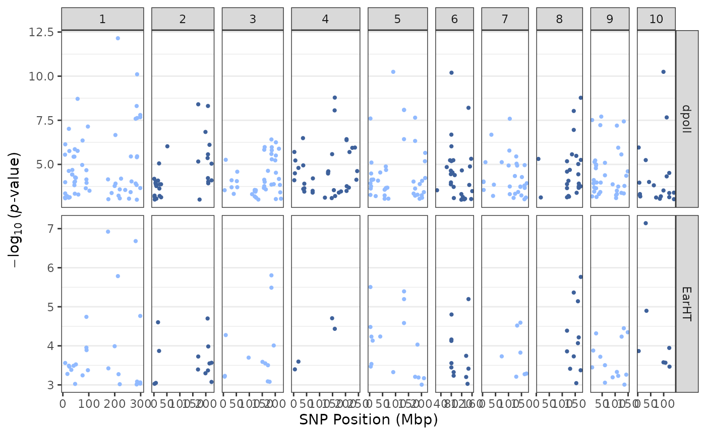
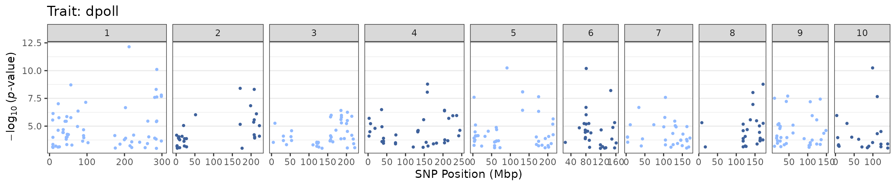
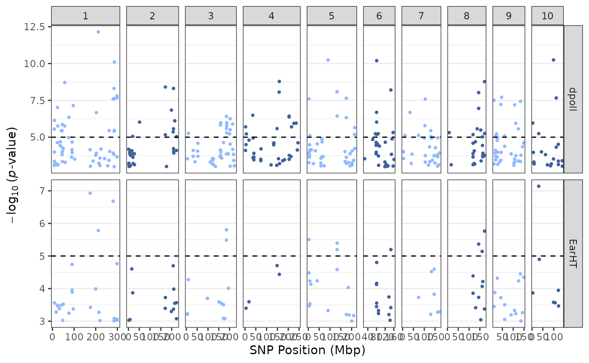
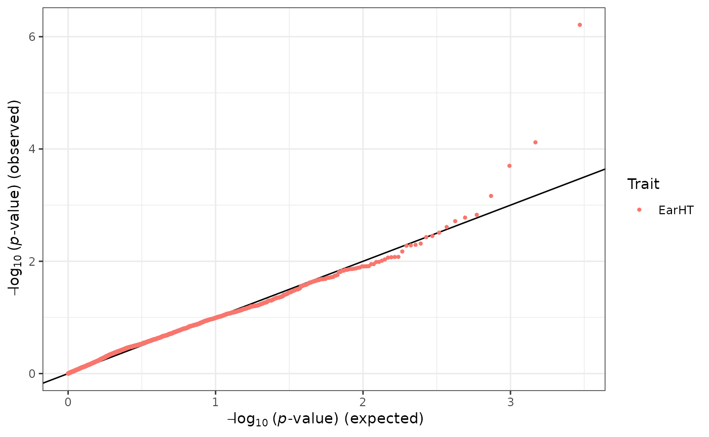
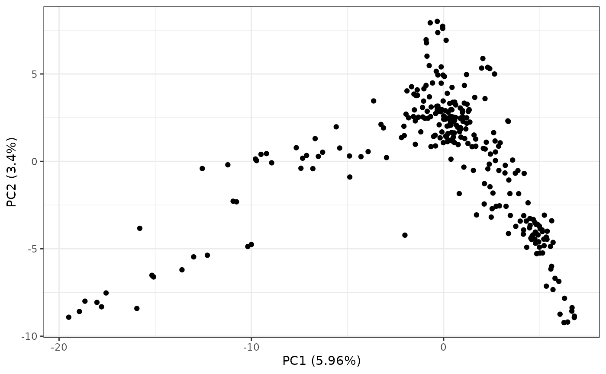
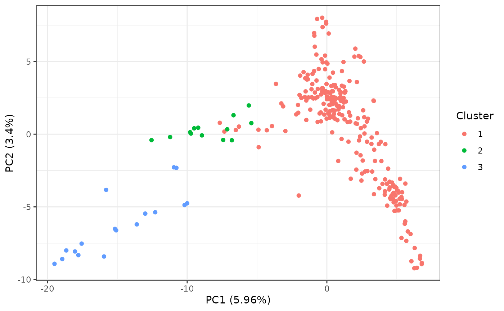
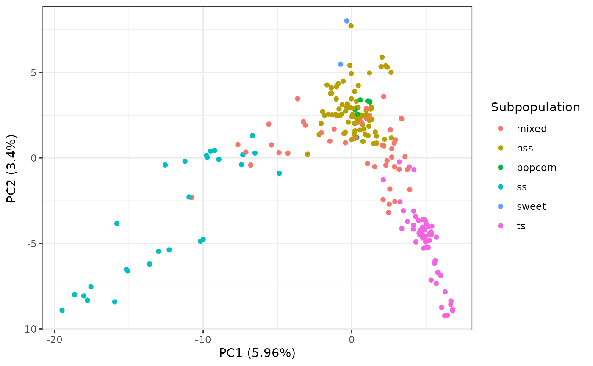
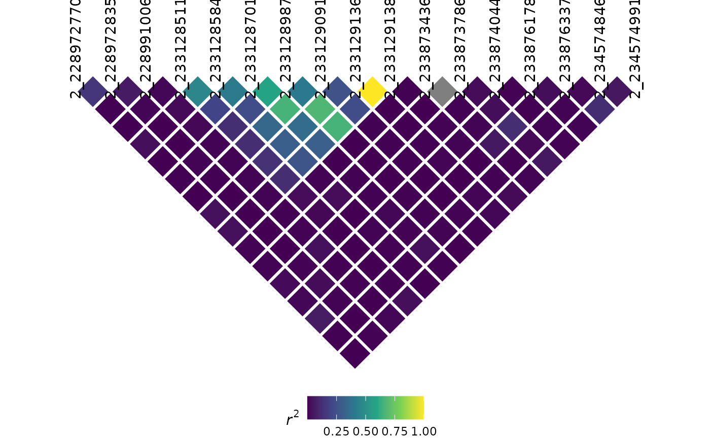

# Getting Started with rTASSEL

## Introduction

### Overview

Thanks for checking out rTASSEL! In this document, we will go over the
functionalities used to work with the TASSEL software via R.

TASSEL is a software package used to evaluate traits associations,
evolutionary patterns, and linkage disequilibrium. Strengths of this
software include:

1.  The opportunity for a number of new and powerful statistical
    approaches to association mapping such as a General Linear Model
    (GLM) and Mixed Linear Model (MLM). MLM is an implementation of the
    technique which our lab’s published Nature Genetics paper - Unified
    Mixed-Model Method for Association Mapping - which reduces Type I
    error in association mapping with complex pedigrees, families,
    founding effects and population structure.

2.  An ability to handle a wide range of indels (insertion & deletions).
    Most software ignore this type of polymorphism; however, in some
    species (like maize), this is the most common type of polymorphism.

More information can be found in the following paper:

> Bradbury PJ, Zhang Z, Kroon DE, Casstevens TM, Ramdoss Y, Buckler ES.
> (2007) *TASSEL: Software for association mapping of complex traits in
> diverse samples.* Bioinformatics 23:2633-2635.

Detailed documentation and source code can be found on our website:

<https://www.maizegenetics.net/tassel>

### Motivation

The main goal of developing this package is to construct an R-based
front-end to connect to a variety of highly used TASSEL methods and
analytical tools. By using R as a front-end, we aim to utilize a
*unified* scripting workflow that exploits the analytical prowess of
TASSEL in conjunction with R’s popular data handling and parsing
capabilities without ever having the user to switch between these two
environments.

### Disclaimer

Due to the *experimental* nature of this package’s lifecycle, end
functionalities are prone to change after end-user input is obtained in
the near future.

### Citation

To cite `rTASSEL`, please use the following citation:

> Monier et al., (2022). rTASSEL: An R interface to TASSEL for analyzing
> genomic diversity. Journal of Open Source Software, 7(76), 4530,
> <https://doi.org/10.21105/joss.04530>

## Preliminary steps

### Setting Memory

Since genome-wide association analyses can use up a lot of computational
resources, memory allocation to `rTASSEL` can be modified. To change the
amount of memory, use the base
[`options()`](https://rdrr.io/r/base/options.html) function and modify
the following parameter:

``` r
options(java.parameters = c("-Xmx<memory>", "-Xms<memory>"))
```

Replace `<memory>` with a specified unit of memory. For example, if I
want to allocate a maximum of 6 GB of memory for my operations, I would
use the input `"-Xmx6g"`, where `g` stands for gigabyte (GB). More
information about memory allocation can be found
[here](https://stackoverflow.com/questions/14763079/what-are-the-xms-and-xmx-parameters-when-starting-jvm).

**NOTE:** Setting Java memory options for `rTASSEL` and any
`rJava`-related packages *needs* to be set *before* loading the
`rTASSEL` package!

### The importance of logging your progress

Before we begin analyzing data, optional parameters can be set up to
make `rTASSEL` more efficient. To prevent your R console from being
overloaded with TASSEL logging information, **it is highly recommended
that you start a logging file**. This file will house all of TASSEL’s
logging output which is beneficial for debugging and tracking the
progress of your analytical workflow. To start a logging file, use the
following command:

``` r
startLogger()
```

If the
[`startLogger()`](https://rtassel.maizegenetics.net/reference/startLogger.md)
file path is set to `NULL`, the logging file will be created in your
current working directory. If you are unsure of what your working
directory is in R, use the base
[`getwd()`](https://rdrr.io/r/base/getwd.html) command.

Additionally, since this is a general walkthrough, certain intricaces of
each function may glossed over. If you would like to study a function in
full, refer to the R documentation by using `?<function>` in the
console, where `<function>` is an `rTASSEL`-based function.

## Reading Data

### Overview

Like TASSEL, `rTASSEL` will read two main types of data:

- Genotype data
- Phenotype data

This data can be read in several different ways. In the following
examples, we will demonstrate various ways genotype and phenotype
information can be loaded into `rTASSEL` objects.

### Loading genotype data

#### From a path

Currently, reading in genotype data to `rTASSEL` is based off of file
locations as paths. Genotype/sequencing data can be stored in a variety
of formats. `rTASSEL` can read and store a wide variety of file types:

- hapmap (HMP)
- HDF5 (hierarchical data format version 5)
- VCF (variant call format)
- Plink

To load this genotype data, simply store your file location as a string
object in R. For this example, we will load two toy data sets - one
being a VCF file and the other being a hapmap file. These data sets can
be accessed via the `rTASSEL` package itself:

``` r
# Load hapmap data
genoPathHMP <- system.file(
    "extdata",
    "mdp_genotype.hmp.txt",
    package = "rTASSEL"
)
genoPathHMP
```

    ## [1] "/home/runner/work/_temp/Library/rTASSEL/extdata/mdp_genotype.hmp.txt"

``` r
# Load VCF data
genoPathVCF <- system.file(
    "extdata",
    "maize_chr9_10thin40000.recode.vcf",
    package = "rTASSEL"
)
genoPathVCF
```

    ## [1] "/home/runner/work/_temp/Library/rTASSEL/extdata/maize_chr9_10thin40000.recode.vcf"

Now that we have the file paths to this data, we can pass this to TASSEL
and create a formal `TasselGenotypePhenotype` class object in R using
the following:

``` r
# Load in hapmap file
tasGenoHMP <- readGenotypeTableFromPath(
    path = genoPathHMP
)
```

    ## The function 'readGenotypeTableFromPath()' will be deprecated soon.
    ## This will be replaced by 'readGenotype()' in the next update.

``` r
# Load in VCF file
tasGenoVCF <- readGenotypeTableFromPath(
    path = genoPathVCF
)
```

    ## The function 'readGenotypeTableFromPath()' will be deprecated soon.
    ## This will be replaced by 'readGenotype()' in the next update.

When we call these objects, a summary of the data will be posted to the
R console:

``` r
tasGenoHMP
```

    ## A TasselGenotypePhenotype Dataset
    ##   Class.............. TasselGenotypePhenotype 
    ##   Taxa............... 281 
    ##   Positions.......... 3093 
    ##   Taxa x Positions... 869133 
    ## ---
    ##   Genotype Table..... [x]
    ##   Phenotype Table.... [ ]

This summary details the number of Taxa (`Taxa`) and marker positions
(`Positions`) within the data set. Additionally, since we can load both
genotype and phenotype information into this object, a helpful check
will be displayed to show what is populating the object (`[x] or [ ]`).

#### Additional information about TasselPhenotypeGenotype data sets

In general, this S4 class data object houses “slot” information relating
to TASSEL/Java pointers of the respective data.

``` r
class(tasGenoHMP)
```

    ## [1] "TasselGenotypePhenotype"
    ## attr(,"package")
    ## [1] "rTASSEL"

``` r
slotNames(tasGenoHMP)
```

    ## [1] "name"            "jTasselObj"      "jTaxaList"       "jPositionList"  
    ## [5] "jGenotypeTable"  "jPhenotypeTable"

Technically, this object does not contain the full information of the
data represented in R space, but merely contains addresses to the memory
store of the reference TASSEL object ID. For example, if we wanted to
extract the `GenotypeTable` with the S4 `@` operator, we would get
something that looks like this:

``` r
tasGenoHMP@jGenotypeTable
```

    ## [1] "Java-Object{net.maizegenetics.dna.snp.CoreGenotypeTable@264f218}"

This entity is a `rJava` internal identifier. It isn’t until we call
downstream `rTASSEL` functions where we will bring the TASSEL data into
the R environment.

### Loading phenotype data

#### From a path

Similar to reading in genotype data, phenotype data can also be read in
via paths. If you already have preconstructed phenotype data in a file,
this option will most likely work best for you. One caveat to this is
how the data file is constructed in terms of columns and trait data for
TASSEL analyses. More information about how these files can be found at
this
[link](https://bitbucket.org/tasseladmin/tassel-5-source/wiki/UserManual/Load/Load)
under the *Numerical Data* section.

Loading this type of data is very similar to how genotype data is
loaded. here, we will use the
[`readPhenotypeFromPath()`](https://rtassel.maizegenetics.net/reference/readPhenotypeFromPath.md)
function:

``` r
# Read from phenotype path
phenoPath  <- system.file("extdata", "mdp_traits.txt", package = "rTASSEL")
phenoPath
```

    ## [1] "/home/runner/work/_temp/Library/rTASSEL/extdata/mdp_traits.txt"

``` r
# Load into rTASSEL `TasselGenotypePhenotype` object
tasPheno <- readPhenotypeFromPath(
    path = phenoPath
)
```

    ## The function 'readPhenotypeFromPath()' will be deprecated soon.
    ## This will be replaced by 'readPhenotype()' in the next update.

``` r
# Inspect object
tasPheno
```

    ## A TasselGenotypePhenotype Dataset
    ##   Class.............. TasselGenotypePhenotype 
    ##   Taxa............... 301 
    ##   Positions.......... NA 
    ##   Taxa x Positions... NA 
    ## ---
    ##   Genotype Table..... [ ]
    ##   Phenotype Table.... [x]
    ## ---
    ##   Traits: Taxa EarHT dpoll EarDia

The object output is very similar to the genotype table output with some
minor additions to which traits are displayed in the file.

#### From an R data frame

In some cases you might want to first modify your phenotype data set in
R and then load it into the TASSEL environment. If you wish to choose
this route, you will need to use the
[`readPhenotypeFromDataFrame()`](https://rtassel.maizegenetics.net/reference/readPhenotypeFromDataFrame.md)
function along with a couple of parameters. First, we will construct an
R data frame and load it with this function:

``` r
# Create phenotype data frame
phenoDF <- read.table(phenoPath, header = TRUE)
colnames(phenoDF)[1] <- "Taxon"

# Inspect first few rows
head(phenoDF)
```

    ##   Taxon EarHT  dpoll     EarDia
    ## 1   811 59.50 -999.0 -999.00000
    ## 2 33-16 64.75   64.5 -999.00000
    ## 3 38-11 92.25   68.5   37.89700
    ## 4  4226 65.50   59.5   32.21933
    ## 5  4722 81.13   71.5   32.42100
    ## 6  A188 27.50   62.0   31.41900

``` r
# Load into rTASSEL `TasselGenotypePhenotype` object
tasPhenoDF <- readPhenotypeFromDataFrame(
    phenotypeDF = phenoDF,
    taxaID = "Taxon",
    attributeTypes = NULL
)
```

    ## The function 'readPhenotypeFromDataFrame()' will be deprecated soon.
    ## This will be replaced by 'readPhenotype()' in the next update.

``` r
# Inspect new object
tasPhenoDF
```

    ## A TasselGenotypePhenotype Dataset
    ##   Class.............. TasselGenotypePhenotype 
    ##   Taxa............... 301 
    ##   Positions.......... NA 
    ##   Taxa x Positions... NA 
    ## ---
    ##   Genotype Table..... [ ]
    ##   Phenotype Table.... [x]
    ## ---
    ##   Traits: Taxa EarHT dpoll EarDia

The `phenotypeDF` parameter is for the R data frame object. The `taxaID`
parameter is needed to determine which column of your data frame is your
TASSEL taxa data. The final parameter (`attributeTypes`) is optional. If
this parameter is set to `NULL`, all remaining data frame columns will
be classified as TASSEL `data` types. If this is not the case for your
data (e.g. if you have covariate or factor data in your experiment),
**you will need to specify which columns are what TASSEL data type**
(i.e. `data`, `covariate`, or `factor`). This will have to be passed as
an R vector of string elements
(e.g. `c("data", "factor", "covariate")`). *Currently*, this data type
needs to be entered in the same order as they are found in the data
frame.

### Loading genotype and phenotype data simultaneously

In association studies, we are interested in combining our genotype and
phenotype data. To usually run this operation in TASSEL, an intersect
combination between the two data sets is needed. To run this in
`rTASSEL`, we can use the
[`readGenotypePhenotype()`](https://rtassel.maizegenetics.net/reference/readGenotypePhenotype.md)
function. The parameter input needed for this function is, of course, a
genotype and phenotype object. For genotype input, the following can be
used:

- a path to a genotype file
- a prior `TasselGenotypePhenotype` object

For phenotype input, the following can be used:

- a path to a phenotype data set,
- a prior `TasselGenotypePhenotype` object
- an R data frame

For example, if we wanted to read the prior `TasselGenotypePhenotype`
genotype and phenotype objects from earlier:

``` r
tasGenoPheno <- readGenotypePhenotype(
    genoPathOrObj = tasGenoHMP,
    phenoPathDFOrObj = tasPheno
)
```

    ## The function 'readGenotypePhenotype()' will be deprecated soon.
    ## This will be replaced by 'join()' in the next update.

``` r
tasGenoPheno
```

    ## A TasselGenotypePhenotype Dataset
    ##   Class.............. TasselGenotypePhenotype 
    ##   Taxa............... 279 
    ##   Positions.......... 3093 
    ##   Taxa x Positions... 862947 
    ## ---
    ##   Genotype Table..... [x]
    ##   Phenotype Table.... [x]
    ## ---
    ##   Traits: Taxa EarHT dpoll EarDia

We can also use a combination of the above parameter options (e.g. load
a genotype path and a phenotype data frame, etc.). One caveat though,
**if you load in a phenotype data frame object with this function, the
prior parameters from the** `readPhenotypeFromDataFrame` **will be
needed** (i.e. the `taxaID` and `attributeTypes` parameters):

``` r
tasGenoPhenoDF <- readGenotypePhenotype(
    genoPathOrObj = genoPathHMP,
    phenoPathDFOrObj = phenoDF,
    taxaID = "Taxon",
    attributeTypes = NULL
)
```

    ## The function 'readGenotypePhenotype()' will be deprecated soon.
    ## This will be replaced by 'join()' in the next update.

    ## The function 'readGenotypeTableFromPath()' will be deprecated soon.
    ## This will be replaced by 'readGenotype()' in the next update.

    ## The function 'readPhenotypeFromDataFrame()' will be deprecated soon.
    ## This will be replaced by 'readPhenotype()' in the next update.

``` r
tasGenoPhenoDF
```

    ## A TasselGenotypePhenotype Dataset
    ##   Class.............. TasselGenotypePhenotype 
    ##   Taxa............... 279 
    ##   Positions.......... 3093 
    ##   Taxa x Positions... 862947 
    ## ---
    ##   Genotype Table..... [x]
    ##   Phenotype Table.... [x]
    ## ---
    ##   Traits: Taxa EarHT dpoll EarDia

### Reading kinship data

rTASSEL also provides users the ability to read in delimited “flat-file”
kinship objects as a `TasselDistanceMatrix` object using the function,
[`readTasselDistanceMatrix()`](https://rtassel.maizegenetics.net/reference/readTasselDistanceMatrix.md):

``` r
## Get toy kinship data from package ----
kinshipPath <- system.file(
  "extdata", 
  "mdp_kinship.txt", 
  package = "rTASSEL"
)

## Read ----
readTasselDistanceMatrix(kinshipPath)
```

    ## A TasselDistanceMatrix Object of 277 x 277 elements:
    ## 
    ##                   33-16      38-11       4226       4722    ...    YU796NS
    ##        33-16     2.0000     0.1816     0.0187     0.0000    ...     0.1162
    ##        38-11     0.1816     2.0000     0.0000     0.1120    ...     0.1421
    ##         4226     0.0187     0.0000     2.0000     0.0000    ...     0.1904
    ##         4722     0.0000     0.1120     0.0000     2.0000    ...     0.0000
    ##          ...        ...        ...        ...        ...    ...        ...
    ##      YU796NS     0.1162     0.1421     0.1904     0.0000    ...     2.0000

### Reading numeric genotype data

TASSEL 5 also has the ability to read in matrix-like genotype data where
instead of reported allele states, probability values between 0 and 1
for a given reference state are reported. These are classified as
`NumericGenotypes` and can behave in similar fashion to standard
allele-based genotype objects for analyses like association (e.g.,
TWAS). We can read this data in two ways:

- From a file (TASSEL 5-formatted `<Numeric>` data):

      <Numeric>
      <Marker> m1  m2   m3
      line_a   0   0.5  0.2
      line_b   1   0    0.123
      line_c   1   0.3  0.1415

- From a formatted R matrix

#### Read numeric data from file

Like other genotype files, we can read this in via
[`readGenotypeTableFromPath()`](https://rtassel.maizegenetics.net/reference/readGenotypeTableFromPath.md):

``` r
numGtPath <- system.file("extdata", "numeric_genotype.txt", package = "rTASSEL")
numGt <- readGenotypeTableFromPath(numGtPath)
```

    ## The function 'readGenotypeTableFromPath()' will be deprecated soon.
    ## This will be replaced by 'readGenotype()' in the next update.

``` r
numGt
```

    ## A TasselGenotypePhenotype Dataset
    ##   Class.............. TasselGenotypePhenotype 
    ##   Taxa............... 3 
    ##   Positions.......... 3 
    ##   Taxa x Positions... 9 
    ## ---
    ##   Genotype Table..... [x]
    ##   Phenotype Table.... [ ]

#### Read numeric data from matrix

To read from an already existing R matrix, make sure that it formatted
properly with row and column names. In the following example, I will
make a function that will simulate an example R matrix with values
between 0 and 1.

``` r
# Simulate numeric matrices
simNumericGt <- function(nRow, nCol) {
    # Matrix values
    minMax <- function(x) (x - min(x)) / (max(x) - min(x))
    d <- rnorm(nCol * nRow) |> minMax()
    m <- matrix(d, nrow = nRow, ncol = nCol)

    # Taxa values
    taxa <- sprintf("line_%02d", seq_len(nRow))

    # Position values
    mIds <- sprintf("marker_%02d", seq_len(nCol))
    mPos <- seq_len(nCol)

    # Add IDs to matrix
    colnames(m) <- mIds
    rownames(m) <- taxa

    return(m)
}

# Simulate a matrix with 5 taxa and 10 sites
simMat <- simNumericGt(5, 10)

# Inspect the first 3 rows and columns
simMat[1:3, 1:3]
```

    ##         marker_01 marker_02 marker_03
    ## line_01 0.1997465 0.6905248 0.3627344
    ## line_02 0.5185338 0.1185218 0.5904937
    ## line_03 0.0000000 0.4217356 0.8670450

Once properly formatted, you read and evaluate this using the
[`readNumericGenotypeFromRMatrix()`](https://rtassel.maizegenetics.net/reference/readNumericGenotypeFromRMatrix.md)
function:

``` r
numGt <- readNumericGenotypeFromRMatrix(simMat)

numGt
```

    ## A TasselGenotypePhenotype Dataset
    ##   Class.............. TasselGenotypePhenotype 
    ##   Taxa............... 5 
    ##   Positions.......... 10 
    ##   Taxa x Positions... 50 
    ## ---
    ##   Genotype Table..... [x]
    ##   Phenotype Table.... [ ]

## Converting TASSEL 5 data into R objects

### Convert genotype data

To convert a TASSEL 5 genotype table into an R `matrix` object, you can
use base R’s [`as.matrix()`](https://rdrr.io/r/base/matrix.html)
function. This will by deafault, return a **dosage matrix** where dosage
is the number of alternative alleles present for a given taxa and site
element:

``` r
gtMat <- as.matrix(tasGenoPheno)

# Show first 10 rows and 4 columns
gtMat[1:10, 1:4]
```

    ##        PZB00859.1 PZA01271.1 PZA03613.2 PZA03613.1
    ## 33-16           2          0          0          2
    ## 38-11           2          2          0          2
    ## 4226            2          0          0          2
    ## 4722            2          2          0          2
    ## A188            0          0          0          2
    ## A214N           2          0          2          0
    ## A239            0          0          2          2
    ## A272            0          0          2          2
    ## A441-5          2          0          0          2
    ## A554            2          2          2          2

### Convert phenotype data

If you want to bring in phenotype data into the R environment, you can
use the
[`getPhenotypeDF()`](https://rtassel.maizegenetics.net/reference/getPhenotypeDF.md)
function. All this function needs is a `TasselGenotypePhenotype` class
object *containing a phenotype table*:

``` r
tasExportPhenoDF <- getPhenotypeDF(tasObj = tasGenoPheno)
```

    ## The function 'getPhenotypeDF()' will be deprecated soon.
    ## This will be replaced by 'as.data.frame()' in the next update.

``` r
head(tasExportPhenoDF)
```

    ##    Taxa EarHT dpoll   EarDia
    ## 1 33-16 64.75  64.5      NaN
    ## 2 38-11 92.25  68.5 37.89700
    ## 3  4226 65.50  59.5 32.21933
    ## 4  4722 81.13  71.5 32.42100
    ## 5  A188 27.50  62.0 31.41900
    ## 6 A214N 65.00  69.0 32.00600

As shown above, an R `tibble`-based data frame is exported with
converted data types translated from TASSEL. See the following table
what TASSEL data types are tranlated into within the R environment:

| TASSEL Data | Converted R Data type |
|:------------|:----------------------|
| taxa        | character             |
| data        | numeric               |
| covariate   | numeric               |
| factor      | factor                |

## Filtering genotype data

**NOTE**: This is just a “snapshot” of how we can filter genotype
information in rTASSEL. For more information, please see the additional
vignette, *“Filtering Genotype Tables”*.

Prior to association analyses, filtration of genotype data may be
necessary. In TASSEL, this accomplished through the Filter menu using
two primary plugins:

- Filter Site Builder plugin
- Filter Taxa Builder plugin

In `rTASSEL`, this can also be accomplished using the follwing
functions:

- [`filterGenotypeTableSites()`](https://rtassel.maizegenetics.net/reference/filterGenotypeTableSites.md)
- [`filterGenotypeTableTaxa()`](https://rtassel.maizegenetics.net/reference/filterGenotypeTableTaxa.md)

These objects take a `TasselGenotypePhenotype` class object. For
example, in our genotype data set, if we want to remove monomorphic and
low coverage sites, we could use the following parameters in
[`filterGenotypeTableSites()`](https://rtassel.maizegenetics.net/reference/filterGenotypeTableSites.md):

``` r
tasGenoPhenoFilt <- filterGenotypeTableSites(
    tasObj = tasGenoPheno,
    siteMinCount = 150,
    siteMinAlleleFreq = 0.05,
    siteMaxAlleleFreq = 1.0,
    siteRangeFilterType = "none"
)
tasGenoPhenoFilt
```

    ## A TasselGenotypePhenotype Dataset
    ##   Class.............. TasselGenotypePhenotype 
    ##   Taxa............... 279 
    ##   Positions.......... 2555 
    ##   Taxa x Positions... 712845 
    ## ---
    ##   Genotype Table..... [x]
    ##   Phenotype Table.... [x]
    ## ---
    ##   Traits: Taxa EarHT dpoll EarDia

We can then compare this to our original pre-filtered data set:

``` r
tasGenoPheno
```

    ## A TasselGenotypePhenotype Dataset
    ##   Class.............. TasselGenotypePhenotype 
    ##   Taxa............... 279 
    ##   Positions.......... 3093 
    ##   Taxa x Positions... 862947 
    ## ---
    ##   Genotype Table..... [x]
    ##   Phenotype Table.... [x]
    ## ---
    ##   Traits: Taxa EarHT dpoll EarDia

These functions can work on any `TasselGenotypePhenotype` class object
that contains genotypic data, regardless of single or combined TASSEL
objects.

## Analysis - Relatedness

### Create a kinship matrix object

In TASSEL, for mixed linear model analyses, a kinship matrix calculated
from genotype data is necessary. This can be accomplished by calculating
a kinship TASSEL object using the function
[`kinshipMatrix()`](https://rtassel.maizegenetics.net/reference/kinshipMatrix.md).
The main parameter input is a `TasselGenotypePhenotype` class object
that contains a genotype data set:

``` r
tasKin <- kinshipMatrix(tasObj = tasGenoPheno)
```

This function allows for several types of algorithm to used using the
`method` parameter. More info about these methods can be found
[here](https://bitbucket.org/tasseladmin/tassel-5-source/wiki/UserManual/Kinship/Kinship).

### Calculate a distance matrix

Very similar to kinship matrix calculation, a distance matrix can also
be calculated using genotype data using the function
[`distanceMatrix()`](https://rtassel.maizegenetics.net/reference/distanceMatrix.md):

``` r
tasDist <- distanceMatrix(tasObj = tasGenoPheno)
```

### `TasselDistanceMatrix` objects

#### Overview

The prior two functions will generate a pairwise matrix
(e.g. $m \times m$ dimensions). The return object is an rTASSEL class,
`TasselDistanceMatrix`. When we inspect the prior object we will see
something like this:

``` r
tasKin
```

    ## A TasselDistanceMatrix Object of 279 x 279 elements:
    ## 
    ##                   33-16      38-11       4226       4722    ...    YU796NS
    ##        33-16     1.7970     0.0396     0.0606    -0.0087    ...    -0.0010
    ##        38-11     0.0396     1.9102     0.0196    -0.0063    ...    -0.0193
    ##         4226     0.0606     0.0196     1.9265    -0.0170    ...     0.1296
    ##         4722    -0.0087    -0.0063    -0.0170     1.4533    ...     0.0326
    ##          ...        ...        ...        ...        ...    ...        ...
    ##      YU796NS    -0.0010    -0.0193     0.1296     0.0326    ...     1.8523

This will showcase the first four rows and columns and the last row and
column if the distance matrix exceeds 5 dimensions (*which it probably
will*).

This object, similar to the `TasselGenotypePhenotype` class, essentially
holds pointers to the Java/TASSEL object in memory. Despite this, we can
still use some base R methods similar to how we handle `matrix` objects:

``` r
tasKin |> colnames() |> head()
```

    ## [1] "33-16" "38-11" "4226"  "4722"  "A188"  "A214N"

``` r
tasKin |> rownames() |> head()
```

    ## [1] "33-16" "38-11" "4226"  "4722"  "A188"  "A214N"

``` r
tasKin |> dim()
```

    ## [1] 279 279

``` r
tasKin |> nrow()
```

    ## [1] 279

``` r
tasKin |> ncol()
```

    ## [1] 279

#### Coercion

If we want to use additional R methods (e.g. plotting, new models,
etc.), we can coerce this object to a general R data object, in this
case, a `matrix` object using the base method
[`as.matrix()`](https://rdrr.io/r/base/matrix.html):

``` r
tasKinR <- tasKin |> as.matrix()

## Inspect first 5 rows and columns ----
tasKinR[1:5, 1:5]
```

    ##             33-16        38-11        4226         4722        A188
    ## 33-16  1.79695500  0.039558496  0.06060006 -0.008674400  0.03524417
    ## 38-11  0.03955850  1.910150900  0.01960259 -0.006317447 -0.02937614
    ## 4226   0.06060006  0.019602593  1.92645570 -0.017025305  0.02449093
    ## 4722  -0.00867440 -0.006317447 -0.01702531  1.453315500 -0.02040117
    ## A188   0.03524417 -0.029376138  0.02449093 -0.020401174  2.00155970

We can also coerce a pairwise `matrix` object to a
`TasselDistanceMatrix` object using rTASSEL’s function
[`asTasselDistanceMatrix()`](https://rtassel.maizegenetics.net/reference/asTasselDistanceMatrix.md):

``` r
## Create a dummy pairwise matrix object ----
set.seed(123)
m <- 10
s <- matrix(rnorm(100), m)
s[lower.tri(s)] <- t(s)[lower.tri(s)]
diag(s) <- 2

## Add sample IDs ----
colnames(s) <- rownames(s) <- paste0("s_", seq_len(m))

testTasselDist <- s |> asTasselDistanceMatrix()
testTasselDist
```

    ## A TasselDistanceMatrix Object of 10 x 10 elements:
    ## 
    ##                     s_1        s_2        s_3        s_4    ...       s_10
    ##          s_1     2.0000     1.2241    -1.0678     0.4265    ...     0.9935
    ##          s_2     1.2241     2.0000    -0.2180    -0.2951    ...     0.5484
    ##          s_3    -1.0678    -0.2180     2.0000     0.8951    ...     0.2387
    ##          s_4     0.4265    -0.2951     0.8951     2.0000    ...    -0.6279
    ##          ...        ...        ...        ...        ...    ...        ...
    ##         s_10     0.9935     0.5484     0.2387    -0.6279    ...     2.0000

### PCA and MDS

rTASSEL can run principal component analysis (PCA) and multidimensional
scaling (MDS) on objects containing a `GenotypeTable` and
`TasselDistanceMatrix` respectively. To run PCA, simply use the
[`pca()`](https://rtassel.maizegenetics.net/reference/pca.md) function
on a `TasselGenotypePhenotype` object that contains a TASSEL
`GenotypeTable`

``` r
tasGenoHMP
```

    ## A TasselGenotypePhenotype Dataset
    ##   Class.............. TasselGenotypePhenotype 
    ##   Taxa............... 281 
    ##   Positions.......... 3093 
    ##   Taxa x Positions... 869133 
    ## ---
    ##   Genotype Table..... [x]
    ##   Phenotype Table.... [ ]

``` r
pcaRes <- pca(tasGenoHMP)
```

To run MDS, simply use the
[`mds()`](https://rtassel.maizegenetics.net/reference/mds.md) function
on a `TasselDistanceMatrix` object:

``` r
tasDist
```

    ## A TasselDistanceMatrix Object of 279 x 279 elements:
    ## 
    ##                   33-16      38-11       4226       4722    ...    YU796NS
    ##        33-16     0.0000     0.2799     0.2794     0.2698    ...     0.2908
    ##        38-11     0.2799     0.0000     0.2920     0.2777    ...     0.3001
    ##         4226     0.2794     0.2920     0.0000     0.2863    ...     0.2795
    ##         4722     0.2698     0.2777     0.2863     0.0000    ...     0.2759
    ##          ...        ...        ...        ...        ...    ...        ...
    ##      YU796NS     0.2908     0.3001     0.2795     0.2759    ...     0.0000

``` r
mdsRes <- mds(tasDist)
```

Both of these will return a `DataFrame` object that will contain a Taxa
ID column and the number of components or axes that were specified in
the function call. For example, let’s take a look at the `pcaRes` object
made previously:

``` r
pcaRes
```

    ## PCAResults object with 3 reports and 5 reported PCs 
    ## Results:
    ##   * PC_Datum (281, 6) 
    ##   * Eigenvalues_Datum (281, 4) 
    ##   * Eigenvectors_Datum (3093, 6)

#### `PCAResults` Table reports

The returned object from running
[`pca()`](https://rtassel.maizegenetics.net/reference/pca.md) is a
`PCAResults` object. This is a collection of TASSEL 5 table report
results that are generated for a given genotype object. We can access
the default principal component data using the
[`tableReport()`](https://rtassel.maizegenetics.net/reference/tableReport.md)
function. I will use base R’s piping operator (`|>`) to better show the
flow of methods: :

``` r
# Return principal components
pcaRes |> tableReport() |> head()
```

    ##    Taxa        PC1       PC2         PC3        PC4        PC5
    ## 1 33-16  0.9156939  2.481178   0.4913800 -0.1637522  0.1649151
    ## 2 38-11 -0.8126642  2.466740  -0.3005079  2.2383745 -0.4102697
    ## 3  4226 -0.2985038  3.159117   1.2616078  1.2285777 -1.2032340
    ## 4  4722  1.3213562  2.933902   2.0517752  0.6883080  7.6429610
    ## 5  A188  0.4099574  2.559685   0.3352381  0.8903318  1.3432841
    ## 6 A214N -6.8010373 -0.417045 -10.7222891 -0.7886181  0.8311523

We can also obtain other reports from the object by specifying the name
of the report. The names of the reports are listed in the object’s
display but we can also return them using
[`reportNames()`](https://rtassel.maizegenetics.net/reference/reportNames.md)

``` r
pcaRes |> reportNames()
```

    ## [1] "PC_Datum"           "Eigenvalues_Datum"  "Eigenvectors_Datum"

``` r
pcaRes |> tableReport("Eigenvalues_Datum") |> head()
```

    ##   PC eigenvalue proportion_of_total cumulative_proportion
    ## 1  0  26.048909          0.05957453            0.05957453
    ## 2  1  14.882874          0.03403752            0.09361206
    ## 3  2   9.664803          0.02210366            0.11571571
    ## 4  3   8.088076          0.01849764            0.13421335
    ## 5  4   7.763265          0.01775479            0.15196814
    ## 6  5   6.796697          0.01554422            0.16751236

## Analysis - Association

### Overview

One of TASSEL’s most powerful functionalities is its capability of
performing a variety of different association modeling techniques. If
you have started reading the walkthrough here it is *strongly suggested
that you read the other components of this walkthrough since the
following parameters require what we have previously created!*

If you are not familar with these methods, more information about how
these operate in base TASSEL can be found at following links:

- [BLUE/GLM](https://bitbucket.org/tasseladmin/tassel-5-source/wiki/UserManual/GLM/GLM)
- [MLM](https://bitbucket.org/tasseladmin/tassel-5-source/wiki/UserManual/MLM/MLM)
- [Fast
  Association](https://bitbucket.org/tasseladmin/tassel-5-source/wiki/UserManual/FastAssociation/FastAssociation)

The
[`assocModelFitter()`](https://rtassel.maizegenetics.net/reference/assocModelFitter.md)
function has several primary components:

- `tasObj`: a `TasselGenotypePhenotype` class R object
- `formula`: an R-based linear model formula
- `fitMarkers`: a boolean parameter to differentiate between BLUE and
  GLM analyses
- `kinship`: a TASSEL kinship object
- `fastAssociation`: a boolean parameter for data sets that have many
  traits

#### Formula syntax

Probably the most important concept of this function is `formula`
parameter. If you are familar with standard R linear model functions,
this concept is fairly similar. In TASSEL, a linear model is composed of
the following scheme:

    y ~ A

…where `y` is any TASSEL `data` type and `A` is any TASSEL `covariate`
and / or `factor` types:

    <data> ~ <covariate> and/or <factor>

This model can be written out in several ways. With the given phenotype
example data, we can have the following variables that are represented
in TASSEL in the following way:

| Trait      | Type          |
|------------|---------------|
| `Taxon`    | `<taxa>`      |
| `dpoll`    | `<data>`      |
| `EarDia`   | `<data>`      |
| `EarHT`    | `<data>`      |
| `location` | `<factor>`    |
| `Q1`       | `<covariate>` |
| `Q2`       | `<covariate>` |
| `Q3`       | `<covariate>` |

Using this data, we could write out the following formula in R

    c(EarHT, dpoll, EarDia) ~ location + Q1 + Q2 + Q3

In the above example, we use the base
[`c()`](https://rdrr.io/r/base/c.html) function to indicate analysis on
multiple numeric data types. For covariate and factor information, we
can use the addition (`+`) operator. One problem with this
implementation is that it can become cumbersome and prone to error if we
want to analyze the entirety of a large data set or all data and/or
factor and covariate types.

A work around for this problem is to utilize a special character to
indicate all elements within the model (`.`). By using the `.` operator
we can simplify the above model into the following:

    . ~ .

This indicates we want to analyze *the whole* data set and leave nothing
out. If we want to analyze all data types and only a handful of factor
and/or covariates, we can use something like this:

    . ~ location + Q1 + Q2

Or vice-versa:

    c(EarHT, dpoll) ~ .

In some instances, we may want to keep all data except for a few
response or predictor types in the formula. Instead of writing out all
variables that we want to include, we can write the exclusionary inverse
by leveraging the minus (`-`) operator. For example, if we want to keep
all data, covariate and factor types from the prior data set **except**
the `Q3` covariate, we can use the following:

    . ~ . - Q3

Another example of exclusion would be to drop all traits of one TASSEL
type (i.e., drop all factor or covariate data from the model). If our
models contain many of one specific type, this can also become
cumbersome and error prone when writing out the model. To circumvent
this, rTASSEL includes a special set of “whitelisted” keywords that we
can use to drop specific trait types:

- `I(cov)`: all traits of type “covariate”
- `I(fct)`: all traits of type “factor”

Using the prior example, if we want to keep all factor traits but remove
all covariate traits (e.g., `Q1`, `Q2`, and `Q3`), we can use the
following:

    . ~ . - I(cov)

For more examples of how to subset phenotype data take a look the
following table:

| Formula                           | Data                       | Covariate        | Factor     |
|-----------------------------------|----------------------------|------------------|------------|
| `. ~ .`                           | `dpoll`, `EarDia`, `EarHT` | `Q1`, `Q2`, `Q3` | `location` |
| `EarHT ~ . - Q2`                  | `EarHT`                    | `Q1`, `Q3`       | `location` |
| `. - dpoll ~ . - Q1 - Q3`         | `EarHT`, `EarDia`          | `Q2`             | `location` |
| `c(dpoll, EarHT) ~ Q1 + location` | `dpoll`, `EarHT`           | `Q1`             | `location` |
| `dpoll + EarHT ~ Q1 + location`   | `dpoll`, `EarHT`           | `Q1`             | `location` |
| `dpoll ~ . - I(cov)`              | `dpoll`                    | *None*           | `location` |
| `. - dpoll ~ Q2 - Q1 - Q3`        | `EarHT`, `EarDia`          | `Q2`             | *None*     |
| `. - dpoll ~ -Q1 - Q3 + Q2`       | `EarHT`, `EarDia`          | `Q2`             | *None*     |
| `dpoll ~ -I(cov) + .`             | `dpoll`                    | *None*           | `location` |

#### Other parameters

Additionally, we can also fit marker and kinship data to our model which
can change our analytical methods. Since these options in TASSEL are
binary, additional parameters are passed for this function. In this
case, genotype/marker data is fitted using the `fitMarker` parameter and
kinship is fitted using the `kinship` parameter.

Fast Association implements methods described by Shabalin (2012). This
method provides an ordinary least squares solution for fixed effect
models. For this method to proper work it is necessary that your have:

- *No missing data in your phenotype data set*
- *Phenotypes and genotypes have been merged using an intersect join*.
  Since this is currently the only option of join genotype and phenotype
  data, you do not have to worry about this *for now*.

**NOTE**: since we are working with “toy” data, empirical insight will
not be elucidated upon in the following steps. This is simply to show
the user how properly use these functions and the outputs that they
give.

In the following examples, we will run example data and in return,
obtain TASSEL association table reports in the form of an R `list`
object containing `tibble`-based R data frames.

### Calculate BLUEs

To caclulate best linear unbiased estimates (BLUEs), numeric phenotype
data can be used along with covariate and factor data *only* if it is
intended to control for field variation. Since genotype data is not
needed for this method, we can leave the `fitMarkers`, `kinship`, and
`fastAssociation` to `NULL` or `FALSE`:

``` r
# Read in phenotype data
phenoPathCov <- system.file("extdata", "mdp_phenotype.txt", package = "rTASSEL")
tasPhenoCov <- readPhenotypeFromPath(phenoPathCov)
```

    ## The function 'readPhenotypeFromPath()' will be deprecated soon.
    ## This will be replaced by 'readPhenotype()' in the next update.

``` r
# Calculate BLUEs
tasBLUE <- assocModelFitter(
    tasObj = tasPhenoCov,
    formula = . ~ .,                  # <- All data is used!
    fitMarkers = FALSE,
    kinship = NULL,
    fastAssociation = FALSE
)
```

    ## Association Analysis : BLUEs

``` r
# Inspect results
tasBLUE
```

    ## AssociationResults object with 2 reports and 3 mapped traits 
    ## Results:
    ##   * BLUE (284, 4) 
    ##   * BLUE_ANOVA (3, 9) 
    ## Traits:
    ##   * EarDia 
    ##   * EarHT 
    ##   * dpoll

#### `AssociationResults` Table reports

In the prior example, we see that
[`assocModelFitter()`](https://rtassel.maizegenetics.net/reference/assocModelFitter.md)
will return a `AssociationResults` object. You can think of this object
as an R list that contains TASSEL 5 table report information encoded as
a `data.frame`-like object. To access the primary report you can apply
the
[`tableReport()`](https://rtassel.maizegenetics.net/reference/tableReport.md)
function to the object. In the following examples, I will use base R’s
piping operator (`|>`) to better show the flow of methods:

``` r
# Return BLUE values for traits
tasBLUE |> tableReport() |> head()
```

    ##    Taxa    EarDia     EarHT     dpoll
    ## 1 33-16  47.23707  82.57471  51.72236
    ## 2 38-11  46.79226 107.20128  56.60072
    ## 3  4226  56.68651  81.89259  53.76318
    ## 4  4722  46.14872  92.82716  62.45617
    ## 5  A188  43.33628  44.50064  49.94743
    ## 6 A214N 185.16560  74.06223 108.88376

We can also obtain other reports from the object by specifying the name
of the report. The names of the reports are listed in the object’s
display but we can also return them using
[`reportNames()`](https://rtassel.maizegenetics.net/reference/reportNames.md)

``` r
tasBLUE |> reportNames()
```

    ## [1] "BLUE"       "BLUE_ANOVA"

``` r
# Return ANOVA results
tasBLUE |> tableReport("BLUE_ANOVA") |> head()
```

    ##    Trait          F             p taxaDF    taxaMS errorDF  errorMS modelDF
    ## 1 EarDia   6.927311  1.673625e-46    281  28.46899     241 4.109674     284
    ## 2  EarHT 166.544583 2.299063e-225    281 695.77834     274 4.177730     284
    ## 3  dpoll  12.060930  1.010474e-76    283  49.36310     269 4.092810     286
    ##     modelMS
    ## 1  29.09466
    ## 2 815.06347
    ## 3  68.87455

### Calculate GLM

Similar to BLUEs, we can fit a generalized linear model (GLM) by simply
fitting marker data to our model. For this, we need a genotype data set
combined with our phenotype data in a `TasselGenotypePhenotype` class
object:

``` r
# Calculate GLM
tasGLM <- assocModelFitter(
    tasObj = tasGenoPheno,          # <- our prior TASSEL object
    formula = c(EarHT, dpoll) ~ .,  # <- only EarHT and dpoll are ran
    fitMarkers = TRUE,              # <- set this to TRUE for GLM
    kinship = NULL,
    fastAssociation = FALSE
)
```

    ## Association Analysis : GLM

``` r
# Inspect results
tasGLM
```

    ## AssociationResults object with 2 reports and 2 mapped traits 
    ## Results:
    ##   * GLM_Stats (473, 18) 
    ##   * GLM_Genotypes (1144, 7) 
    ## Traits:
    ##   * EarHT 
    ##   * dpoll

``` r
# Return association statistics
tasGLM |> tableReport() |> head()
```

    ##   Trait      Marker Chr      Pos  marker_F            p marker_Rsq    add_F
    ## 1 EarHT  PZA00447.8   1  9024005 13.618030 0.0002749614 0.05165819 13.61803
    ## 2 EarHT  PZB00718.1   1 17601375  7.781280 0.0005240456 0.05730746 15.11327
    ## 3 EarHT  PZD00098.1   1 23267898 13.283879 0.0003234342 0.04878687 13.28388
    ## 4 EarHT  PZA02921.4   1 25035053 13.188472 0.0003414352 0.04992069 13.18847
    ## 5 EarHT PZA00654.12   1 32583282 12.812893 0.0004119944 0.04784271 12.81289
    ## 6 EarHT  PZA00274.7   1 41505016  8.286272 0.0003240040 0.05949095 10.56148
    ##          add_p    dom_F     dom_p marker_df marker_MS error_df error_MS
    ## 1 0.0002749614      NaN       NaN         1  5362.791      250 393.8008
    ## 2 0.0001289429 0.479874 0.4891073         2  3029.927      256 389.3867
    ## 3 0.0003234342      NaN       NaN         1  5217.500      259 392.7693
    ## 4 0.0003414352      NaN       NaN         1  5169.563      251 391.9759
    ## 5 0.0004119944      NaN       NaN         1  5093.203      255 397.5061
    ## 6 0.0013050779 5.817597 0.0165545         2  3268.492      262 394.4466
    ##   model_df model_MS minorObs
    ## 1        1 5362.791      124
    ## 2        2 3029.927      105
    ## 3        1 5217.500      108
    ## 4        1 5169.563      101
    ## 5        1 5093.203       16
    ## 6        2 3268.492       55

### Calculate MLM

Adding to our complexity, we can fit a mixed linear model (MLM) by
adding kinship to our analysis. In addition to the prior parameters, we
will also need a TASSEL kinship object (see *Create a kinship matrix
object* in the *Analysis - Relatedness* section):

``` r
# Calculate MLM
tasMLM <- assocModelFitter(
    tasObj = tasGenoPheno,             # <- our prior TASSEL object
    formula = EarHT ~ .,               # <- run only EarHT
    fitMarkers = TRUE,                 # <- set this to TRUE for GLM
    kinship = tasKin,                  # <- our prior kinship object
    fastAssociation = FALSE
)
```

    ## Association Analysis : MLM

``` r
# Inspect results
tasMLM
```

    ## AssociationResults object with 3 reports and 1 mapped traits 
    ## Results:
    ##   * MLM_Effects (7211, 7) 
    ##   * MLM_Stats (3094, 18) 
    ##   * MLM_Residuals_EarHT (279, 2) 
    ## Traits:
    ##   * EarHT

### Calculate Fast Association

We can run fast association analysis in our GLM model by setting the
`fastAssociation` parameter to `TRUE`. **NOTE**: this is only really
effective if you have many phenotype traits:

``` r
# Read data - need only non missing data!
phenoPathFast <-system.file(
    "extdata",
    "mdp_traits_nomissing.txt",
    package = "rTASSEL"
)

# Creat rTASSEL object - use prior TASSEL genotype object
tasGenoPhenoFast <- readGenotypePhenotype(
    genoPathOrObj = tasGenoHMP,
    phenoPathDFOrObj = phenoPathFast
)
```

    ## The function 'readGenotypePhenotype()' will be deprecated soon.
    ## This will be replaced by 'join()' in the next update.

``` r
# Calculate MLM
tasFAST <- assocModelFitter(
    tasObj = tasGenoPhenoFast,         # <- our prior TASSEL object
    formula = . ~ .,                   # <- run all of the phenotype data
    fitMarkers = TRUE,                 # <- set this to TRUE for GLM
    kinship = NULL,
    fastAssociation = TRUE             # <- set this to TRUE for fast assoc.
)
```

    ## Association Analysis : Fast Association

``` r
# Inspect results
tasFAST
```

    ## AssociationResults object with 1 reports and 3 mapped traits 
    ## Results:
    ##   * FastAssociation (640, 7) 
    ## Traits:
    ##   * dpoll 
    ##   * EarDia 
    ##   * EarHT

### Calculate Stepwise Regression

Additionally, we can also run stepwise regression via TASSEL 5’s
`StepwiseOLSModelFitterPlugin` using the
[`stepwiseModelFitter()`](https://rtassel.maizegenetics.net/reference/stepwiseModelFitter.md)
function with similar formula syntax found in the prior sections:

``` r
stepRes <- stepwiseModelFitter(
    tasObj  = tasGenoPhenoFast,
    formula = dpoll ~ .
)

# Inspect results
stepRes
```

    ## AssociationResults object with 4 reports and 1 mapped traits 
    ## Results:
    ##   * ANOVA_report (22, 13) 
    ##   * ANOVA_report_ci (22, 15) 
    ##   * marker_estimates (20, 6) 
    ##   * marker_estimates_ci (20, 6) 
    ## Traits:
    ##   * dpoll

## Analysis - Phylogeny

`rTASSEL` allows for interfacing with TASSEL’s tree generation methods
from genotype information. This can be performed using the
[`createTree()`](https://rtassel.maizegenetics.net/reference/createTree.md)
method with a `TasselGenotypePhenotype` object containing genotype table
information:

``` r
phyloTree <- createTree(
    tasObj = tasGenoHMP,
    clustMethod = "Neighbor_Joining"
)
```

The above function allows for two clustering methods:

- `Neighbor_Joining` - Neighbor Joining method. More info can be found
  [here](https://en.wikipedia.org/wiki/Neighbor_joining)
- `UPGMA` - **U**nweighted **P**air **G**roup **M**ethod with
  **A**rithmetic **M**ean. More info can be found
  [here](https://en.wikipedia.org/wiki/UPGMA).

Upon creation, the `phyloTree` object is returned as a `phylo` object
generated by the
[ape](https://cran.r-project.org/web/packages/ape/ape.pdf) package:

``` r
phyloTree
```

    ## 
    ## Phylogenetic tree with 281 tips and 279 internal nodes.
    ## 
    ## Tip labels:
    ##   33-16, CI7, L317, MOG, 38-11, PA91, ...
    ## 
    ## Unrooted; includes branch length(s).

This object can then be used by common base-R methods
(e.g. [`plot()`](https://rdrr.io/r/graphics/plot.default.html)) or other
visualization libraries such as
[ggtree](https://bioconductor.org/packages/release/bioc/html/ggtree.html).

## Visualizations

### Overview

`rTASSEL` supports a wealth of information rich and easily generated
plots via the `plot*` family of functions. In the following sections, we
will briefly go over some of the capabilities.

### Manhattan plots

To generate Manhattan plots from GWAS data, we can use the
[`plotManhattan()`](https://rtassel.maizegenetics.net/reference/plotManhattan.md)
function. To make this as streamlined as possible, we can pass our prior
`AssociationResults` objects to the default plotting function:

``` r
tasGLM |> plotManhattan()
```


Since we mapped 2 traits, the resulting plot will have 2 facets: 1 row
for each trait. We can also specify a singular trait or a collection of
traits by passing a singular `character` object or a collection (i.e.,
[`c()`](https://rdrr.io/r/base/c.html)) of `character` objects,
respectively, into the `trait` parameter:

``` r
tasGLM |> plotManhattan(trait = "dpoll")
```



We can also set a threshold value to highlight visually “significant”
markers of interest by passing a $- log_{10}$ value to the `threshold`
parameter:

``` r
tasGLM |> plotManhattan(threshold = 5)
```



We pass different colors for column facets by passing color values to
the `colors` parameter:

``` r
tasGLM |> plotManhattan(colors = c("red", "#4890bd", "#2ad14e"))
```



We can also make plots interactive by setting the `interactive`
parameter to `TRUE`:

``` r
tasGLM |> plotManhattan(interactive = TRUE)
```

### QQ plots

To generate quantile-quantile plots, we can pass our
`AssociationResults` data to
[`plotQQ()`](https://rtassel.maizegenetics.net/reference/plotQQ.md)

``` r
tasMLM |> plotQQ()
```



### PCA plots

Using similar syntax to our association results, we can leverage the
same concept PCA results by passing `PCAResults` objects to the
[`plotPCA()`](https://rtassel.maizegenetics.net/reference/plotPCA.md)
function:

``` r
pcaRes |> plotPCA()
```


By default, this will generate a scatter plot of the first two principal
components (PCs) along with the percent variation captured by the PC. We
can perform hierarchical clustering of the points by setting the
`cluster` parameter to `TRUE`. This will by default, cluster the data
into 2 clusters. We can specify more cluster by setting the `nClust`
parameter. For example, if I want to generate 3 clusters:

``` r
pcaRes |> plotPCA(cluster = TRUE, nClust = 3)
```



We can also generate coloring by adding metadata to the plot as a simple
`data.frame` like object along with the specified column in the metadata
using the `metadata` and `mCol` parameters, respectively:

``` r
metaPath <- system.file("extdata", "mdp_taxa_metadata.csv", package = "rTASSEL")
metaDf <- read.csv(metaPath)

pcaRes |> plotPCA(metadata = metaDf, mCol = "Subpopulation")
```



### Scree plots

In conjunction with PCA scatter plots, another common plot is a “Scree
plot”. This is used to identify how much of the variation is captured
with $n$ amount of principal components. By default, this will generate
data for 10 PCs and can be overridden via the `n` parameter:

``` r
pcaRes |> plotScree(n = 5)
```



### LD plots

Similarly, we can also visualize LD using automated methods. Like most
LD plots, it is wise to filter your genotype information to a specific
region of interest:

``` r
# Filter genotype table by position
tasGenoPhenoFilt <- filterGenotypeTableSites(
    tasObj              = tasGenoPheno,
    siteRangeFilterType = "position",
    startPos            = 228e6,
    endPos              = 300e6,
    startChr            = 2,
    endChr              = 2
)

# Generate and visualize LD
myLD <- ldPlot(
    tasObj  = tasGenoPhenoFilt,
    ldType  = "All",
    plotVal = "r2",
    verbose = FALSE
)

myLD
```



## Interactive Visualizations (deprecated)

**NOTE**: These methods will soon be removed from rTASSEL

### Overview

Since `rTASSEL` can essentially interact with all of TASSEL’s API,
interactive “legacy” Java-based visualizers can be accessed. Currently,
`rTASSEL` has capabilities to use the LD viewer and Archaeopteryx.

### LD Viewer

TASSEL’s linkage disequilibrium (LD) viewer can be used via the
[`ldJavaApp()`](https://rtassel.maizegenetics.net/reference/ldJavaApp.md)
function. This method will take a `TasselGenotypePhenotype` object
containing genotype information. A common parameter to set is the window
size (`windowSize`) since creating a full genotype matrix is rather
impractical at this point in time for most modern machines and
experimental design. This will create comparisons only within a given
range of indexes:

``` r
tasGenoHMP |> ldJavaApp(windowSize = 100)
```


### Tree Viewer - Archaeopteryx

Since TASSEL allows for phylogenetic tree creation, one common
Java-based visualizer to use is the
[Archaeopteryx](https://www.phylosoft.org/archaeopteryx/) tree viewer
which is implemented in the source code. To view this, we can use the
[`treeJavaApp()`](https://rtassel.maizegenetics.net/reference/treeJavaApp.md)
function. In the following example, we will first filter 6 taxa and then
pass the filtered genotype object to the Java visualizer:

``` r
tasGenoHMP |> 
    filterGenotypeTableTaxa(
      taxa = c("33-16", "38-11", "4226", "4722", "A188", "A214N")
    ) |> 
    treeJavaApp()
```


## Genomic Prediction

### Overview

`rTASSEL` also allows for phenotypic prediction through genotype
information via genomic best linear unbiased predictors (gBLUPs). It
proceeds by fitting a mixed model that uses kinship to capture
covariance between taxa. The mixed model can calculate BLUPs for taxa
that do not have phenotypes based on the phenotypes of lines with
relationship information.

A phenotype dataset and a kinship matrix must be supplied as input to
the method by selecting both then choosing Analysis/Genomic Selection.
In addition to trait values, the phenotype dataset may also contain
factors or covariates which will be used as fixed effects in the model.
All taxa in the phenotype dataset can only appear once. No repeated
values are allowed for a single taxon. When the analysis is run, the
user is presented with the choice to run k-fold cross-validation. If
cross- validation is selected, then the number of folds and the number
of iterations can be entered. For each iteration and each fold within an
iteration, the correlation between the observed and predicted values
will be reported. If cross-validation is not selected, then the original
observations, predicted values and PEVs (prediction error variance) will
be reported for all taxa in the dataset.

When k-fold cross-validation is performed, only taxa with phenotypes and
rows in the kinship matrix are used. That set of taxa are divided into k
subsets of equal size. Each subset in turn is used as the validation
set. Phenotypes of the individuals in the validation are set to 0 then
predicted using the remaining individuals as the training set. The
correlation (r) of the observed values and predicted values is
calculated for the validation set and reported. The mean and standard
deviation of the mean of the r’s are calculated for each trait and
reported in the comments section of the “Accuracy” data set that is
output by the analysis. In general, the results are not very sensitive
to the choice of k. The number of iterations affects the standard error
of the mean for the accuracy estimates. The defaults of k = 5 and
iterations = 20 will be adequate for most users.

``` r
tasCV <- genomicPrediction(
    tasPhenoObj = tasGenoPheno,
    kinship     = tasKin,
    doCV        = TRUE,
    kFolds      = 5,
    nIter       = 1
)
head(tasCV)
```

    ## DataFrame with 6 rows and 4 columns
    ##         Trait Iteration      Fold  Accuracy
    ##   <character> <numeric> <numeric> <numeric>
    ## 1       EarHT         0         0  0.501444
    ## 2       EarHT         0         1  0.376098
    ## 3       EarHT         0         2  0.506010
    ## 4       EarHT         0         3  0.594796
    ## 5       EarHT         0         4  0.528185
    ## 6       dpoll         0         0  0.785085
