```{r setup, include=FALSE}
knitr::opts_chunk$set(
    fig.path='figure/graphics-',
    cache.path='cache/graphics-',
    fig.align='center',
    external=TRUE,
    echo=TRUE,
    warning=FALSE
    # fig.pos="H"
)
```


# Introduction

## Genotype table overview
In this vignette, we will discuss how you can filter genotype tables
in `rTASSEL`. As a reminder, a genotype table in TASSEL is essentially an
$n \times p$ matrix consisting of $n$ samples or taxa with $p$ genotypic
observations. To illustrate this, see the diagram below:

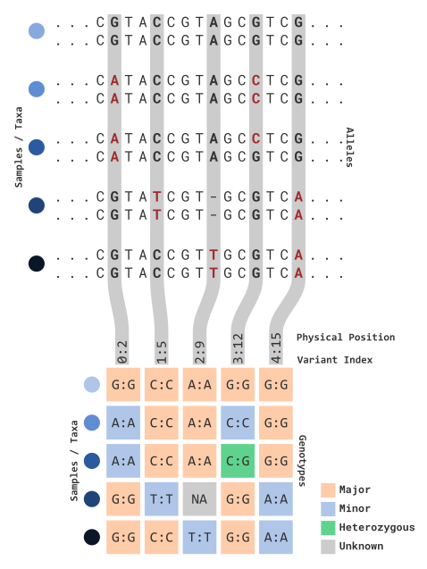

In this illustration, sequence information is processed for variant sites of
each parental copy. Variant data is partitioned into an $n \times p$
matrix for each sample and relevant variant marker information (e.g. `0:2`). 
This includes:

* The TASSEL index for each variant site (`<this value> : `)
  + *Note:* since TASSEL is coded in Java, this value will start at 0!
* The physical position (bp) for each variant site (` : <this value>`)

Genotype information (e.g. each $n \times p$ element) can be viewed in several 
ways. The default view (as shown above) reflects the following:

| Cell Type     | Definition                                          | Color      |
|---------------|-----------------------------------------------------|------------|
| Major alleles | The most frequently observed allele of each column  | Yellow     |
| Minor alleles | The least frequently observed allele of each column | Blue       |
| Heterozygous  | Sites where parental copies differ (e.g. `C:G`)     | Green      |
| Unknown       | Sites where no information is given (e.g. `NA`s)    | Grey/White |


## Filtering basics
Since TASSEL allows for many features to be represented in a genotype table,
`rTASSEL`'s filtration parameters are numerous. In the following sections, we will
discuss how each set of parameters work. In general, these filtration schemes
can be applied for samples (i.e. rows) and marker information (i.e. columns).

The two main methods to accomplish this are:

* `filterGenotypeTableTaxa()`
* `filterGenotypeTableSites()`

For each section example code will be given with an illustrated genotype table 
to explain each method. Prior knowledge about `rTASSEL` data structures is needed
so please refere to the vignette *Getting Started with rTASSEL* if you are
new to this package!

*Note:* We will be using the the `magrittr` pipe operator `%>%` for the
following examples. More information about this can be found [here](https://cran.r-project.org/web/packages/magrittr/vignettes/magrittr.html).


# Filtering by sites...

## Overview
In order to filter by variant sites (e.g. marker information), we can use the 
function `filterGenotypeTableSites()`. This function was modeled after TASSEL's 
`FilterSiteBuilder` plugin to ensure familiarity between the two methods.
The parameters can be broken up into several components:

* Genotype information
  + `siteMinCount`
  + `siteMinAlleleFreq`
  + `siteMaxAlleleFreq`
  + `minHeterozygous`
  + `maxHeterozygous`
* Indexed variant sites
  + `startSite`
  + `endSite`
* Physical marker positions
  + `startChr`
  + `endChr`
  + `startPos`
  + `endPos`
* R objects
  + `gRangesObj`
* External files
  + `bedFile`
  + `chrPosFile`
  
*Note:* While the following examples will illustrate these parameters in
simplified formats, genotype information parameters *and* marker index and 
position parameters (i.e. indexed variant sites, physical marker positions,
R objects, or external files) can be passed simultaneously! 

Let's assume we have an `rTASSEL` data object that contains a genotype table:

```{r, eval=FALSE}
myGT
```

```
## A TasselGenotypePhenotype Dataset
##   Class.............. TasselGenotypePhenotype 
##   Taxa............... 5 
##   Positions.......... 5
##   Taxa x Positions... 25
## ---
##   Genotype Table..... [x]
##   Phenotype Table.... [ ]
```

Let's also assume it contains the same structure as the prior illustration:


In order for us to understand how the next few parameters work, we will
illustrate how allelic frequencies are calculated:

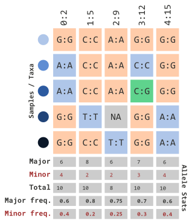


## ...using allelic frequency
If we want to filter by minor allele frequency, we can use the following
parameters...

```{r, eval=FALSE}
myGT %>% 
    filterGenotypeTableSites(
        siteMinAlleleFreq = 0.3,
        siteMaxAlleleFreq = 1.0
    )
```

...which will remove the following columns:

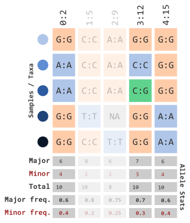

We can also set a range using a limit with the `siteMaxAlleleFreq` parameter...

```{r, eval=FALSE}
myGT %>% 
    filterGenotypeTableSites(
        siteMinAlleleFreq = 0.2,
        siteMaxAlleleFreq = 0.3
    )
```

...which will remove the following columns:

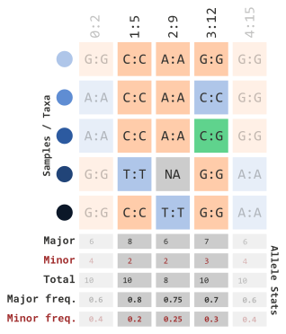


## ...using `NA` data
We can also filter by missing sites (encoded in TASSEL with `N`). Similar to
how we calculated frequency of minor alleles, we can apply the same logic with
missing data with the `siteMinCount` parameter:

```{r, eval=FALSE}
myGT %>% 
    filterGenotypeTableSites(
        siteMinCount = 5
    )
```

This parameter can range from 0 to the number of rows (e.g. taxa) within
your genotype table. Since our example data only has 5 rows, this prior example
will filter out any markers that contain at least 1 missing variant marker site:

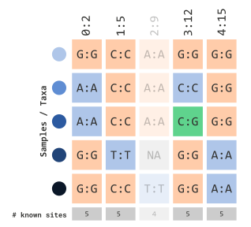


## ...using heterozygosity frequency
Similar to the prior two sections, we can filter by calculated frequency of
heterozygous sites using the parameters, `minHeterozygous` and 
`maxHeterozygous`. For example, if we wanted to filter sites containing $>$
10% heterozygous sites, we could use the following:

```{r, eval=FALSE}
myGT %>% 
    filterGenotypeTableSites(
        minHeterozygous = 0.0,
        maxHeterozygous = 0.1
    )
```

which would filter out sites with calculated frequencies:

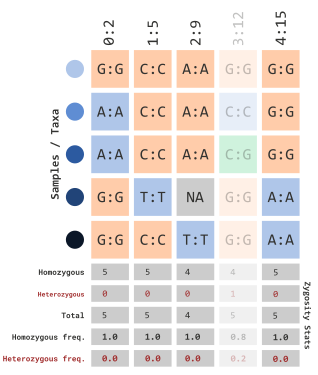


## ...using variant indexes
For the next several sections we will be illustrating how to filter sites
using positional information for each marker. To better explain these concepts,
let's modify our genotype table (`myGT`) to showcase (1) a broader range of positions
and (2) different sequence IDs (i.e. chromosomes). *Note* Chromosome IDs are
not illustrated this way in TASSEL and are only for demonstration purposes.

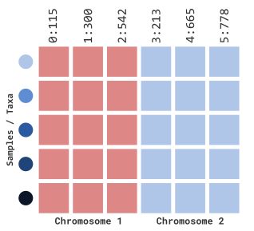

To filter by site index, we must first set the `siteRangeFilterType` parameter 
to `sites`. Next, we will be able to use the parameters, `startSite` and 
`endSite`:

```{r, eval=FALSE}
myGT %>% 
    filterGenotypeTableSites(
        siteRangeFilterType = "sites",
        startSite = 1,
        endSite = 3
    )
```

In our example above, this will retain indexed sites 1 through 3:

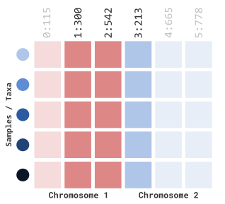


## ...using physical positions
To filter by physical positions, we must first set the `siteRangeFilterType`
parameter to `position`. Next we will be able to use the parameters:

* `startChr`
* `startPos`
* `endChr`
* `endPos`

The `*Chr` parameters will specify which chromosomes or sequence IDs will
remain and `*Pos` parameters will specify the physical positions within each
chromosome sequence. For example, if we wanted to filter just chromosome 1,
we can specify the following parameters:

```{r, eval=FALSE}
myGT %>% 
    filterGenotypeTableSites(
        siteRangeFilterType = "position",
        startChr = 1,
        endChr = 1,
        startPos = NULL,
        endPos = NULL
    )
```

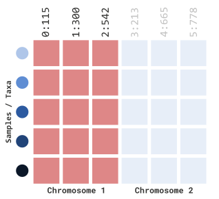

If we want to be more specific in our filtering, we can include positional
information as well:

```{r, eval=FALSE}
myGT %>% 
    filterGenotypeTableSites(
        siteRangeFilterType = "position",
        startChr = 1,
        endChr = 2,
        startPos = 250,
        endPos = 700
    )
```

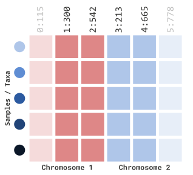


## ...using `GRanges` objects
In the prior example, we have manually set parameters to filter by physical
position. The caveat to this process is that you can only specify a "fixed"
range of start and stop positions. For more dynamic filtering options, we can
specify either external files (*next section*) or range-based R objects.

`GRanges` class objects from the `GenomicRanges` package serve as the standard
data structure for representing genomic locations within the Bioconductor
project. A basic representation of this class entails the following data types:

* `seqnames` - an `Rle` object of sequence IDs (e.g. chromsomes)
* `ranges` - an `IRanges` object of start and stop coordinates for range info
* `strand` - an `Rle` object representing sequence strand info (`+`, `-`, or `*`)

For our example, we will represent a `GRanges` object as the variable `gr`:

```{r, eval=FALSE}
gr
```

```
## GRanges object with 3 ranges and 0 metadata columns:
##       seqnames    ranges strand
##          <Rle> <IRanges>  <Rle>
##   [1]     chr1   250-500      *
##   [2]     chr2   213-400      *
##   [3]     chr2   500-700      *
##   -------
##   seqinfo: 2 sequences from an unspecified genome; no seqlengths
```

To implement this in our filtration method, we can pass this `GRanges` object
into our `gRangesObj` parameters and setting `siteRangeRilterType` to `"none"`:

```{r, eval=FALSE}
myGT %>% 
    filterGenotypeTableSites(
        siteRangeFilterType = "none",
        gRangesObj = gr
    )
```

Which will dynamically filter the following marker indexes:

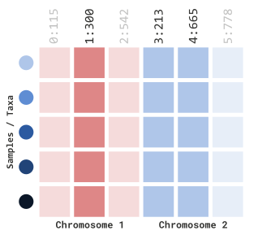


## ...using BED files
`rTASSEL` allows filtering for both external
[BED files](https://m.ensembl.org/info/website/upload/bed.html) 
and chromosomal position files. Similar to our `GRanges` object, BED files can 
also represent genomic range information but as a flat file. In our example, 
let's take the same range information and save it as a BED file:

```{r, engine='bash', eval=FALSE}
$ cat my_ranges.bed

chr1    250   500
chr2    213   400
chr2    500   700
```

This external file can be passed to our filtration method by setting
`siteRangeFilterType` to `"none"` and entering the location of the file on
disk in the `bedFile` parameter:

```{r, eval=FALSE}
myGT %>% 
    filterGenotypeTableSites(
        siteRangeFilterType = "none",
        bedFile = "my_ranges.bed"
    )
```

This will filter our genotype table as previously shown in `GRanges` section:


## ...using chromsomal position files
Similar to a BED file, we can also pass a chromosomal position file. This is
a tab-separated file of two columns:

* `Chromosome` - the sequence or chromosome ID for each marker
* `Position` - the physical position (bp) of each marker

In our example, this would look something like this:

```{r, engine='bash', eval=FALSE}
$ cat my_chr_pos.tsv

Chromsome   Position
1   300
2   213
2   665
```

This external file can be passed to our filtration method by setting
`siteRangeFilterType` to `"none"` and entering the location of the file on
disk in the `chrPosFile` parameter:

```{r, eval=FALSE}
myGT %>% 
    filterGenotypeTableSites(
        siteRangeFilterType = "none",
        bedFile = "my_chr_pos.tsv"
    )
```

This will also filter our genotype table as previously shown in `GRanges` 
section:


# Filtering by taxa

## Overview
In the prior sections we have discussed how to filter $p$ observations (i.e. 
columns). In the following sections, we will illustrate ways to filter $n$ rows.
In order to filter by variant sites (e.g. marker information), we can use the 
function `filterGenotypeTableTaxa()`. This function was modeled after TASSEL's 
`FilterTaxaBuilder` plugin to ensure familiarity between the two methods.

While not as complex as site filtration, taxa filtration parameters can be
seperated into the following sections:

* Genotype information
  + `minNotMissing`
  + `minHeterozygous`
  + `maxHeterozygous`
* R objects
  + `taxa`

Since we will be filtering by taxa, let's represent our toy illustration to
contain actual maize taxa IDs instead of colorful circles. This is similar to 
how this would be encoded in
TASSEL:

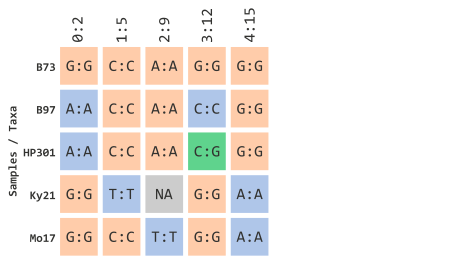

## ...using `NA` data
Similar to site filtration, we can filter by missing sites (encoded in TASSEL 
with `N`). Instead of column (e.g. marker) filtration, this will filter taxa 
(rows) based on missing data. Similar to how we calculated frequency of minor 
alleles, we can apply the same logic with missing data with the `minNotMissing` 
parameter:

```{r, eval=FALSE}
myGT %>% 
    filterGenotypeTableTaxa(
        minNotMissing = 1.0
    )
```

This parameter is based on the "missingness" frequency calculated for each row in
your genotype table. Since our example data only has 5 rows, this prior example
will filter out any taxa that contain at least 1 missing variant marker site:

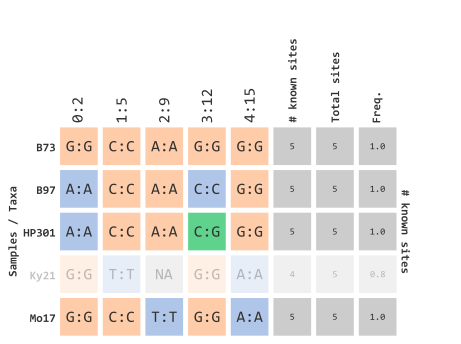


## ...using heterozygosity frequency
We can also filter taxa by calculated frequency of heterozygous sites using the 
parameters, `minHeterozygous` and `maxHeterozygous`. For example, if we wanted 
to filter all taxa that contain at least one heterozygous site, we could employ
the following parameters:

```{r, eval=FALSE}
myGT %>% 
    filterGenotypeTableTaxa(
        minHeterozygous = 0.0,
        maxHeterozygous = 0.0
    )
```

which would filter out taxa with calculated frequencies:

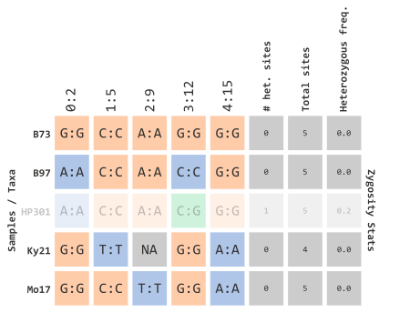


## ...using R objects
Filtering select taxa IDs can be achieved by passing an atomic vector of 
`character` data types to the `taxa` parameter. In our example, we will
select the following IDs:

```{r, eval=FALSE}
myFavTaxa
```

```
## [1] "B73"  "B97"  "Ky21"
```

This vector can passed to the following argument:

```{r, eval=FALSE}
myGT %>% 
    filterGenotypeTableTaxa(
        taxa = myFavTaxa
    )
```

Which will filter out any IDs that are *not* contained in the previous vector
object:

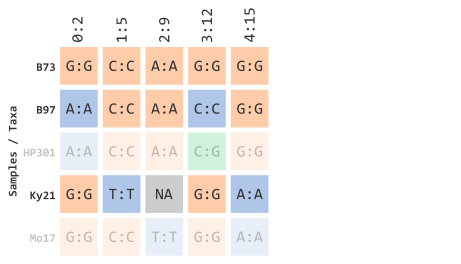

This vector logic can applied to various types of subsetting methods in R. For
example, if we had all of the taxa represented in one vector:

```{r, eval=FALSE}
allTaxa
```

```
## [1] "B73"   "B97"   "HP301" "Ky21"  "Mo17"
```

We could filter from this object using regular expressions. One common method
is using the `str_subset` method from the `stringr` 
[package](https://stringr.tidyverse.org/) in conjunction with the `magrittr`
pipe operator `%>%`:

```{r, eval=FALSE}
myGT %>% 
    filterGenotypeTableTaxa(
        taxa = allTaxa %>% str_subset("^B|^Ky")
    )
```

This will create a subsetted vector containing our taxa IDs of interest in the
prior example:


While this example might be rather basic, this method is quite powerful if
dealing with a massive breeding panel of several hundred samples.


# Piping methods together

## Example 1
Like with all good practices in R and programming, various `rTASSEL` methods 
can be "piped" together in one continuous flow of steps. For example, we could
filter simultaneously on sites *and* taxa using both methods in conjunction 
with the `magrittr` pipe operator `%>%`. Let's use our previous toy data set:


Let's (1) select taxa IDs that start with the letter "B" or "K" *and* (2) select
indexed TASSEL marker sites 1 through 3. This will filter elements shown below:

```{r, eval=FALSE}
myGT %>%
    filterGenotypeTableTaxa(
        taxa = allTaxa %>% str_subset("^B|^Ky")
    ) %>% 
    filterGenotypeTableSites(
        siteRangeFilterType = "sites",
        startSite = 1,
        endSite = 3
    )
```

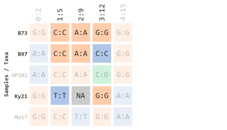


## Example 2
We can also implement the same methods with other `rTASSEL` methods. In this
example we will (1) select taxa IDs that start with the letter "B" or "K", (2) select
indexed TASSEL marker sites 1 through 3, *and* (3) export to a VCF flat file:

```{r, eval=FALSE}
myGT %>%
    filterGenotypeTableTaxa(
        taxa = allTaxa %>% str_subset("^B|^Ky")
    ) %>% 
    filterGenotypeTableSites(
        siteRangeFilterType = "sites",
        startSite = 1,
        endSite = 3
    ) %>% 
    exportGenotypeTable(
        file = "my_filtered_gt.vcf"
        format = "vcf"
    )
```


