```{r setup, include=FALSE}
library(rTASSEL)

knitr::opts_chunk$set(
    fig.path='figure/graphics-',
    cache.path='cache/graphics-',
    fig.align='center',
    external=TRUE,
    echo=TRUE,
    warning=FALSE
    # fig.pos="H"
)
```


# Introduction

## Genotype table overview
In this vignette, we will discuss how you can filter genotype tables
in `rTASSEL`. As a reminder, a genotype table in TASSEL is essentially an
$n \times p$ matrix consisting of $n$ samples or taxa with $p$ genotypic
observations. To illustrate this, see the diagram below:

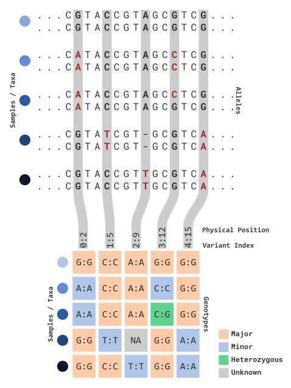

In this illustration, sequence information is processed for variant sites of
each parental copy. Variant data is partitioned into an $n \times p$
matrix for each sample and relevant variant marker information (e.g. `0:2`). 
This includes:

* The TASSEL index for each variant site (`<this value> : `)
  + *Note:* since TASSEL is coded in Java, this value will start at 0! In
    `rTASSEL`, site indexes are 1-based like every other index in R. The
    underlying TASSEL index is still reported in the `Site` column of
    `positionList()`.
* The physical position (bp) for each variant site (` : <this value>`)

Genotype information (e.g. each $n \times p$ element) can be viewed in several 
ways. The default view (as shown above) reflects the following:

| Cell Type     | Definition                                          | Color      |
|---------------|-----------------------------------------------------|------------|
| Major alleles | The most frequently observed allele of each column  | Yellow     |
| Minor alleles | The least frequently observed allele of each column | Blue       |
| Heterozygous  | Sites where parental copies differ (e.g. `C:G`)     | Green      |
| Unknown       | Sites where no information is given (e.g. `NA`s)    | Grey/White |


## Two ways to filter
`rTASSEL` offers two interchangeable grammars for filtering. Both build
the same selection under the hood and return a new object of the same class
they were given, so you can use whichever reads better to you - and mix them
freely in the same script. Every example in this vignette is shown in both
forms.

### Bracket subsetting
The first is the bracket (`[`) syntax used to subset a `matrix` or
`data.frame` in R:

```
myGT[<taxa>, <sites>]
```

Rows (`i`) select taxa and columns (`j`) select marker sites, and either
index can be left empty to keep everything on that axis. Instead of writing
out indexes by hand, criteria are described with **selector functions**:

| Selector       | Axis  | Selects sites/taxa by                              |
|----------------|-------|----------------------------------------------------|
| `taxa()`       | Taxa  | Literal taxa IDs                                   |
| `taxaWhere()`  | Taxa  | An expression over taxa metadata                   |
| `sites()`      | Sites | Site index (1-based)                               |
| `siteIds()`    | Sites | Literal marker names                               |
| `chrom()`      | Sites | Chromosome (sequence) ID                           |
| `region()`     | Sites | Genomic coordinates or a `GRanges` object          |
| `sitesWhere()` | Sites | An expression over site metadata                   |

Any selector can be inverted with `!`.

### Verbs
The second is a set of pipe-friendly **verbs** modelled on the `dplyr`
package. Where `dplyr`'s verbs address one axis each, a genotype table has
two, so each verb comes in a taxa and a sites flavour:

| Verb                            | Modelled on       | Selects taxa/sites by         |
|---------------------------------|-------------------|-------------------------------|
| `filterTaxa()`, `filterSites()` | `dplyr::filter()` | Expressions over metadata     |
| `selectTaxa()`, `selectSites()` | `dplyr::select()` | Literal IDs and `tidyselect`  |
| `sliceTaxa()`, `sliceSites()`   | `dplyr::slice()`  | Position (1-based)            |

Otherwise they behave as their `dplyr` namesakes do: `filter*()` takes any
number of predicates and combines them with `&`, `select*()` takes the whole
`tidyselect` vocabulary (`all_of()`, `any_of()`, `starts_with()`,
`matches()`, ...), and `slice*()` takes positions where a leading `-` drops
instead of keeps.

### How the two line up
Each selector has a verb counterpart:

| Selector       | Verb equivalent                                           |
|----------------|-----------------------------------------------------------|
| `taxa()`       | `selectTaxa()`                                            |
| `taxaWhere()`  | `filterTaxa()`                                            |
| `sites()`      | `sliceSites()`                                            |
| `siteIds()`    | `selectSites()`                                           |
| `chrom()`      | `filterSites()` on the `chrom` column                     |
| `region()`     | `filterSites()` on `chrom` and `pos`, or with `overlaps()` |
| `sitesWhere()` | `filterSites()`                                           |

Two conventions differ. Criteria that a selector combines with `&` become
separate arguments to a `filter*()` verb, matching `dplyr::filter()`. And
where a selector is inverted with `!`, a verb follows `dplyr`: `filter*()`
negates the predicate itself, while `select*()` and `slice*()` drop with a
leading `-`.

*Note:* We will be using the base R pipe operator `|>` for the verb examples.
More information about this can be found [here](https://cran.r-project.org/web/packages/magrittr/vignettes/magrittr.html).

**Prior knowledge about `rTASSEL` data structures is needed, so please refer
to the vignette *Getting Started with rTASSEL* if you are new to this
package!**

If you are migrating existing scripts, the deprecated
`filterGenotypeTableSites()`, `filterGenotypeTableTaxa()`, and
`filterGenotypeTableBySiteName()` functions still work but will warn. A
complete argument-by-argument mapping to both grammars is given in the final
section of this vignette.


## A real data set
Most of the examples below use a toy illustration so that the effect of each
filter can be seen cell by cell. To see actual output, we will also use the
hapmap file shipped with `rTASSEL`, read in with `readGenotype()`:

```{r, eval=TRUE, echo=TRUE}
genoPath <- system.file("extdata", "mdp_genotype.hmp.txt", package = "rTASSEL")

myRealGT <- readGenotype(genoPath)
myRealGT
```

Filtering returns a new object of the same class, leaving the original
untouched. Here is the same filter in both grammars, keeping sites with a
minor allele frequency of at least 5%:

```{r, eval=TRUE, echo=TRUE}
myRealGT[, sitesWhere(maf >= 0.05)]
```

```{r, eval=TRUE, echo=TRUE}
myRealGT |> filterSites(maf >= 0.05)
```

From here on, each example is given first with brackets and then with verbs.


# Filtering by sites...

## Overview
Marker (column) criteria are passed as the second bracket index or to a
`*Sites()` verb. The `sitesWhere()` selector and the `filterSites()` verb
evaluate an R expression against per-site metadata, and these columns are
available in that expression:

| Column        | Description                                              |
|---------------|----------------------------------------------------------|
| `siteIndex`   | 1-based position of the site in the table                 |
| `siteId`      | Marker name                                               |
| `chrom`       | Chromosome (sequence) ID                                  |
| `pos`         | Physical position (bp)                                    |
| `maf`         | Minor allele frequency                                    |
| `alleleCount` | Number of non-missing alleles (2 per diploid taxon)       |
| `het`         | Proportion of taxa that are heterozygous                  |
| `isIndel`     | Whether the site contains an indel (`+` or `-`)           |
| `isBiallelic` | Whether the site has two or fewer allelic states          |

Positional criteria are covered by the dedicated `sites()`, `siteIds()`,
`chrom()`, and `region()` selectors on the bracket side, and by
`sliceSites()`, `selectSites()`, and the `chrom` and `pos` columns on the
verb side.

Let's assume we have an `rTASSEL` genotype object:

```{r, eval=FALSE}
myGT
```

```
# A TasselGenotype object: 5 taxa × 5 sites

# ℹ Java memory address: 0x4c1d9d4b
```

Let's also assume it contains the same structure as the prior illustration:

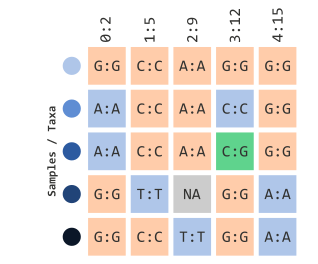

In order for us to understand how the next few parameters work, we will
illustrate how allelic frequencies are calculated:

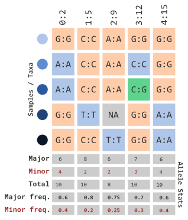


## ...using allelic frequency
If we want to keep only sites above a minor allele frequency threshold, we
can filter on the `maf` column:

```{r, eval=FALSE}
myGT[, sitesWhere(maf >= 0.3)]

myGT |> filterSites(maf >= 0.3)
```

...which will remove the following columns:

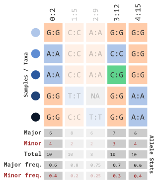

A range is expressed with two comparisons. Since `sitesWhere()` takes an
ordinary R expression, they are joined with `&`; `filterSites()` takes them
as separate arguments and joins them for you:

```{r, eval=FALSE}
myGT[, sitesWhere(maf >= 0.2 & maf <= 0.3)]

myGT |> filterSites(maf >= 0.2, maf <= 0.3)
```

...which will remove the following columns:

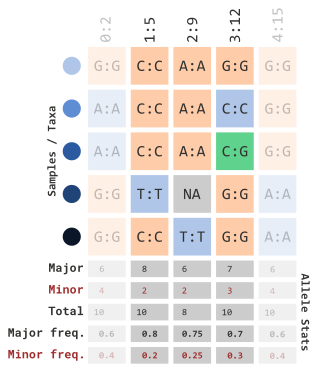


## ...using `NA` data
We can also filter by missing sites (encoded in TASSEL with `N`). Similar to
how we calculated frequency of minor alleles, we can apply the same logic
with missing data using the `alleleCount` column, which counts the alleles
that were actually called at a site:

```{r, eval=FALSE}
myGT[, sitesWhere(alleleCount >= 10)]

myGT |> filterSites(alleleCount >= 10)
```

Our example data has 5 taxa, and each diploid taxon carries 2 alleles, so a
fully called site has an `alleleCount` of 10. Requiring all 10 filters out
any marker with at least 1 missing call:

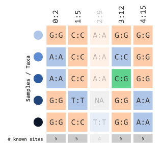


## ...using heterozygosity frequency
Similar to the prior two sections, we can filter by calculated frequency of
heterozygous sites using the `het` column. For example, if we wanted to
filter sites containing $>$ 10% heterozygous calls, we could use the
following:

```{r, eval=FALSE}
myGT[, sitesWhere(het <= 0.1)]

myGT |> filterSites(het <= 0.1)
```

which would filter out sites with calculated frequencies:

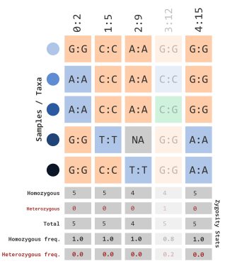


## ...using variant indexes
For the next several sections we will be illustrating how to filter sites
using positional information for each marker. To better explain these concepts,
let's modify our genotype table (`myGT`) to showcase (1) a broader range of positions
and (2) different sequence IDs (i.e. chromosomes). *Note* Chromosome IDs are
not illustrated this way in TASSEL and are only for demonstration purposes.

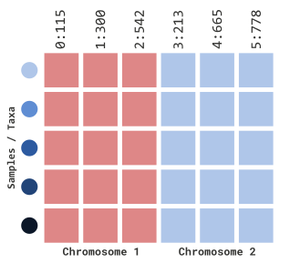

To filter by site index, we use the `sites()` selector or the `sliceSites()`
verb. Site indexes here are 1-based, so the second through fourth markers of
the table are:

```{r, eval=FALSE}
myGT[, sites(2:4)]

myGT |> sliceSites(2:4)
```

Note that the labels in the illustration (`1:300`, `2:542`, `3:213`) show
TASSEL's own 0-based index, which is always one less than the index passed to
`sites()` or `sliceSites()`. In our example above, this retains the following
markers:

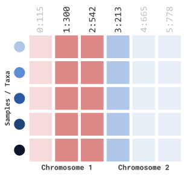

On the bracket side, a bare numeric vector does the same thing, so the
selector can be dropped when indexes are all that is needed:

```{r, eval=FALSE}
myGT[, 2:4]
```


## ...using chromosomes
Whole chromosomes (or sequence IDs) are selected with `chrom()`, which
accepts any number of IDs. The verb form is a predicate on the `chrom`
column:

```{r, eval=FALSE}
myGT[, chrom("1")]

myGT |> filterSites(chrom == "1")
```

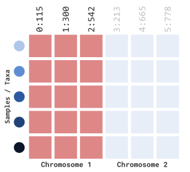

Several chromosomes are `chrom("1", "2")` on the bracket side and
`filterSites(chrom %in% c("1", "2"))` on the verb side.


## ...using physical positions
To filter within a chromosome, `region()` takes a chromosome ID and a start
and end coordinate in base pairs. The verb form spells the same window out
as predicates on the `chrom` and `pos` columns:

```{r, eval=FALSE}
myGT[, region("1", 250, 542)]

myGT |> filterSites(chrom == "1", pos >= 250, pos <= 542)
```

Applied to our real data set, we can pull a 10 Mbp window from chromosome 2:

```{r, eval=TRUE, echo=TRUE}
myRealGT[, region("2", 20e6, 30e6)]
```

```{r, eval=TRUE, echo=TRUE}
myRealGT |> filterSites(chrom == "2", pos >= 20e6, pos <= 30e6)
```


## ...using `GRanges` objects
`region()` handles a single, contiguous window on one chromosome. For
anything more dynamic (several windows, or windows on different
chromosomes), we can hand it a range-based R object instead.

`GRanges` class objects from the `GenomicRanges` package serve as the standard
data structure for representing genomic locations within the Bioconductor
project. A basic representation of this class entails the following data types:

* `seqnames` - an `Rle` object of sequence IDs (e.g. chromsomes)
* `ranges` - an `IRanges` object of start and stop coordinates for range info
* `strand` - an `Rle` object representing sequence strand info (`+`, `-`, or `*`)

For our example, we will represent a `GRanges` object as the variable `gr`:

```{r, eval=FALSE}
gr
```

```
## GRanges object with 3 ranges and 0 metadata columns:
##       seqnames    ranges strand
##          <Rle> <IRanges>  <Rle>
##   [1]     chr1   250-500      *
##   [2]     chr2   213-400      *
##   [3]     chr2   500-700      *
##   -------
##   seqinfo: 2 sequences from an unspecified genome; no seqlengths
```

This object is passed to `region()` in place of a chromosome and coordinate
pair. On the verb side, ranges are tested with `overlaps()`, a helper that
only has meaning inside a site predicate:

```{r, eval=FALSE}
myGT[, region(gr)]

myGT |> filterSites(overlaps(gr))
```

Which will dynamically filter the following marker indexes:

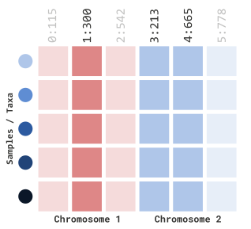

Here is the same idea on our real data set, keeping two windows on two
different chromosomes:

```{r, eval=TRUE, echo=TRUE}
gr <- GenomicRanges::GRanges(
    seqnames = c("1", "2"),
    ranges   = IRanges::IRanges(
        start = c(20e6, 100e6),
        end   = c(30e6, 150e6)
    )
)

myRealGT[, region(gr)]
```

```{r, eval=TRUE, echo=TRUE}
myRealGT |> filterSites(overlaps(gr))
```

Because `overlaps()` is a predicate, it can be combined with other site
criteria in a single expression - something `region()` cannot do, since it
occupies the whole site index on its own. `overlaps()` works inside
`sitesWhere()` as well, so the bracket form gets the same ability:

```{r, eval=TRUE, echo=TRUE}
myRealGT[, sitesWhere(overlaps(gr) & maf >= 0.05)]
```

```{r, eval=TRUE, echo=TRUE}
myRealGT |> filterSites(overlaps(gr), maf >= 0.05)
```


## ...using BED and chromosome position files
`GRanges` objects are also how external range files are filtered on. Similar
to a `GRanges` object,
[BED files](https://m.ensembl.org/info/website/upload/bed.html) represent
genomic range information but as a flat file. In our example, let's take the
same range information and save it as a BED file:

```{r, engine='bash', eval=FALSE}
$ cat my_ranges.bed

chr1    250   500
chr2    213   400
chr2    500   700
```

Read the file into a `GRanges` object with `rtracklayer::import()` and pass
it to `region()` or `overlaps()`:

```{r, eval=FALSE}
myGT[, region(rtracklayer::import("my_ranges.bed"))]

myGT |> filterSites(overlaps(rtracklayer::import("my_ranges.bed")))
```

The same approach covers chromosome position files - a tab-separated file of
two columns:

* `Chromosome` - the sequence or chromosome ID for each marker
* `Position` - the physical position (bp) of each marker

In our example, this would look something like this:

```{r, engine='bash', eval=FALSE}
$ cat my_chr_pos.tsv

Chromosome  Position
1   300
2   213
2   665
```

Since each row is a single point rather than a range, the start and end
coordinates are the same position:

```{r, eval=FALSE}
chrPos <- read.table("my_chr_pos.tsv", sep = "\t", header = TRUE)

gr <- GenomicRanges::GRanges(
    seqnames = chrPos$Chromosome,
    ranges   = IRanges::IRanges(start = chrPos$Position, end = chrPos$Position)
)

myGT[, region(gr)]

myGT |> filterSites(overlaps(gr))
```


## ...using marker names
Markers can also be selected by their literal IDs with `siteIds()` or
`selectSites()`:

```{r, eval=TRUE, echo=TRUE}
myRealGT[, siteIds("PZB00859.1", "PZA01271.1")]
```

```{r, eval=TRUE, echo=TRUE}
myRealGT |> selectSites("PZB00859.1", "PZA01271.1")
```

Marker names held in a variable are passed to `siteIds()` directly, or on
the bracket side as a bare character vector. `selectSites()` follows
`tidyselect`, which asks for `all_of()` around a variable so that a typo in
the variable name cannot be mistaken for a marker name:

```{r, eval=TRUE, echo=TRUE}
myMarkers <- c("PZB00859.1", "PZA01271.1")

myRealGT[, myMarkers]
```

```{r, eval=TRUE, echo=TRUE}
myRealGT |> selectSites(all_of(myMarkers))
```

The rest of the `tidyselect` vocabulary is available too. `any_of()`
silently skips markers that are not in the table, and `starts_with()`,
`ends_with()`, and `matches()` select by pattern:

```{r, eval=TRUE, echo=TRUE}
myRealGT |> selectSites(starts_with("PZA00"))
```


## Inverting a selection
Any selector can be negated with `!`, which keeps everything the selector
would have removed. For example, to drop the first ten markers:

```{r, eval=TRUE, echo=TRUE}
myRealGT[, !sites(1:10)]
```

The verbs follow `dplyr` instead: `sliceSites()` and `selectSites()` drop
with a leading `-`, and `filterSites()` negates the predicate itself:

```{r, eval=TRUE, echo=TRUE}
myRealGT |> sliceSites(-(1:10))
```

```{r, eval=FALSE}
myGT[, !siteIds("rs1", "rs2")]        # myGT |> selectSites(-any_of(c("rs1", "rs2")))
myGT[, !sitesWhere(isIndel)]          # myGT |> filterSites(!isIndel)
```

Predicate expressions can be inverted either way - `!sitesWhere(isIndel)`
and `sitesWhere(!isIndel)` are equivalent.


# Filtering by taxa

## Overview
In the prior sections we have discussed how to filter $p$ observations (i.e. 
columns). In the following sections, we will illustrate ways to filter $n$
rows, which are passed as the *first* bracket index or to a `*Taxa()` verb.

Like `sitesWhere()` and `filterSites()`, the `taxaWhere()` selector and the
`filterTaxa()` verb evaluate an R expression, here against per-taxon
metadata:

| Column       | Description                                        |
|--------------|----------------------------------------------------|
| `taxaId`     | Taxon name                                         |
| `notMissing` | Proportion of sites with a genotype call           |
| `het`        | Proportion of sites that are heterozygous          |

Both proportions are taken over the total number of sites in the table.

Since we will be filtering by taxa, let's represent our toy illustration to
contain actual maize taxa IDs instead of colorful circles. This is similar to 
how this would be encoded in TASSEL:

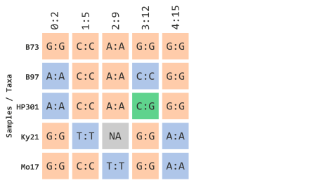


## ...using `NA` data
Similar to site filtration, we can filter by missing sites (encoded in TASSEL 
with `N`). Instead of column (e.g. marker) filtration, this will filter taxa 
(rows) based on missing data using the `notMissing` column:

```{r, eval=FALSE}
myGT[taxaWhere(notMissing >= 1.0), ]

myGT |> filterTaxa(notMissing >= 1.0)
```

This filters out any taxa that contain at least 1 missing variant marker site:

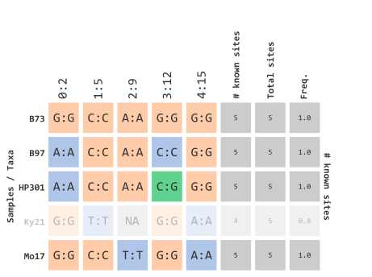


## ...using heterozygosity frequency
We can also filter taxa by calculated frequency of heterozygous sites using
the `het` column. For example, if we wanted to filter all taxa that contain
at least one heterozygous site, we could use the following:

```{r, eval=FALSE}
myGT[taxaWhere(het <= 0.0), ]

myGT |> filterTaxa(het <= 0.0)
```

which would filter out taxa with calculated frequencies:

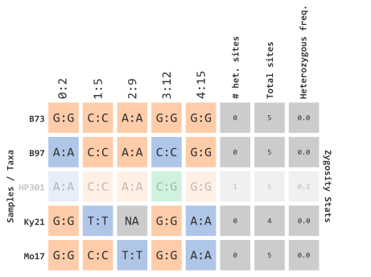


## ...using taxa IDs
Filtering select taxa IDs can be achieved by passing `character` values to
the `taxa()` selector or the `selectTaxa()` verb. In our example, we will
select the following IDs:

```{r, eval=FALSE}
myGT[taxa("B73", "B97", "Ky21"), ]

myGT |> selectTaxa("B73", "B97", "Ky21")
```

Which will filter out any IDs that are *not* listed:

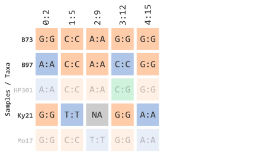

`taxa()` also accepts a vector, so IDs can be prepared with any R code. As
with markers, `selectTaxa()` asks for `all_of()` around a variable:

```{r, eval=FALSE}
myFavTaxa <- c("B73", "B97", "Ky21")

myGT[taxa(myFavTaxa), ]

myGT |> selectTaxa(all_of(myFavTaxa))
```

...and, as with sites, a bare character vector can be used directly in the
brackets:

```{r, eval=TRUE, echo=TRUE}
myRealGT[c("33-16", "38-11", "4226"), ]
```

```{r, eval=TRUE, echo=TRUE}
myRealGT |> selectTaxa(c("33-16", "38-11", "4226"))
```


## ...using arbitrary expressions
Because `taxaWhere()` and `filterTaxa()` evaluate a regular R expression,
taxa IDs can be matched with any function that returns a logical vector.
This makes patterns that previously required building a vector by hand a
single call:

```{r, eval=FALSE}
# All taxa whose ID starts with "B" or "Ky"
myGT[taxaWhere(grepl("^B|^Ky", taxaId)), ]

myGT |> filterTaxa(grepl("^B|^Ky", taxaId))
```

```{r, eval=TRUE, echo=TRUE}
myRealGT[taxaWhere(startsWith(taxaId, "CML")), ]
```

```{r, eval=TRUE, echo=TRUE}
myRealGT |> filterTaxa(startsWith(taxaId, "CML"))
```

For pattern matching on IDs alone, `selectTaxa()` with a `tidyselect`
helper is the shorter spelling:

```{r, eval=TRUE, echo=TRUE}
myRealGT |> selectTaxa(starts_with("CML"))
```

Metadata columns and IDs can be mixed in the same expression:

```{r, eval=TRUE, echo=TRUE}
myRealGT[taxaWhere(startsWith(taxaId, "CML") & notMissing >= 0.9), ]
```

```{r, eval=TRUE, echo=TRUE}
myRealGT |> filterTaxa(startsWith(taxaId, "CML"), notMissing >= 0.9)
```


# Combining filters

## Sites and taxa in one call
Both bracket indexes can be given at once, which filters taxa and sites in a
single expression. With verbs, the two axes are filtered by piping one verb
into the next. Let's use our previous toy data set:


Let's (1) select taxa IDs that start with the letter "B" or "K" *and* (2)
select the second through fourth markers. This will filter elements shown
below:

```{r, eval=FALSE}
myGT[taxaWhere(grepl("^B|^Ky", taxaId)), sites(2:4)]

myGT |>
    filterTaxa(grepl("^B|^Ky", taxaId)) |>
    sliceSites(2:4)
```

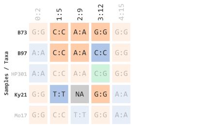


The bracket method filters taxa before sites, so site metrics such as `maf`
and `het` are calculated against the taxa that survived the first index
rather than the whole table. With verbs the order is whatever you pipe, so
put the taxa verb first to get the same result.


## Chaining filters
Because each filter returns a genotype object, filters can also be applied
one after another. This is equivalent to passing both indexes at once, and
is often easier to read when several steps are involved:

```{r, eval=TRUE, echo=TRUE}
myFiltGT <- myRealGT[taxaWhere(notMissing >= 0.8), ]
myFiltGT <- myFiltGT[, sitesWhere(maf >= 0.05)]

myFiltGT
```

This is the case the verbs are built for, since each one takes an object
and returns one:

```{r, eval=TRUE, echo=TRUE}
myRealGT |>
    filterTaxa(notMissing >= 0.8) |>
    filterSites(maf >= 0.05)
```

The two grammars can also be mixed in one pipeline. Since a bracket
expression is just a value, it can start a chain of verbs, and a verb's
result can be subset with brackets:

```{r, eval=FALSE}
myRealGT[taxaWhere(notMissing >= 0.8), ] |>
    filterSites(maf >= 0.05)
```

Filtered objects can be passed to any other `rTASSEL` function, such as
writing the result out to a VCF file:

```{r, eval=FALSE}
myRealGT[taxaWhere(notMissing >= 0.8), sitesWhere(maf >= 0.05)] |>
    exportGenotypeTable(
        file   = "my_filtered_gt.vcf",
        format = "vcf"
    )

myRealGT |>
    filterTaxa(notMissing >= 0.8) |>
    filterSites(maf >= 0.05) |>
    exportGenotypeTable(
        file   = "my_filtered_gt.vcf",
        format = "vcf"
    )
```


## Filtering genomic datasets
Everything above applies unchanged to `TasselGenomicDataset` objects, which
hold genotype and phenotype data joined on their shared taxa. Filtering one
re-joins the phenotype data against the taxa that survive, so both halves of
the dataset stay in step:

```{r, eval=TRUE, echo=TRUE}
phenoPath <- system.file("extdata", "mdp_traits.txt", package = "rTASSEL")

myDataset <- readGenomicDataset(myRealGT, phenoPath)

myDataset[taxaWhere(notMissing >= 0.9), sitesWhere(maf >= 0.05)]
```

The verbs accept datasets on the same terms:

```{r, eval=TRUE, echo=TRUE}
myDataset |>
    filterTaxa(notMissing >= 0.9) |>
    filterSites(maf >= 0.05)
```

A dataset also carries phenotype data, which the verbs can filter in its own
right. `selectTraits()`, `filterTraits()`, and `sliceTraits()` address the
trait axis, and `filterTaxa()` reads its expressions to decide which half of
the dataset to filter: naming a phenotype column selects observations, while
anything else - including `notMissing` and `het`, which keep their genotype
meaning throughout - filters the genotype table. Either way the two halves
are re-joined, so a taxon left without any observations is dropped from the
genotype table as well.

```{r, eval=TRUE, echo=TRUE}
# One trait, all taxa
myDataset |> selectTraits(EarHT)

# Genotype and phenotype criteria in one call
myDataset |> filterTaxa(notMissing >= 0.9, EarHT > 100)
```

The phenotype verbs are covered in full in the vignette *Filtering
Phenotype Data*.


# Transforming genotype calls
Filtering selects a subset of the taxa and sites already in a table. A
related operation is recoding the calls themselves, which is not a selection
and therefore is neither a selector nor a verb.

`removeMinorSNPStates()` collapses every site down to its two most common
allelic states, recoding any remaining states as missing:

```{r, eval=TRUE, echo=TRUE}
myRealGT |> removeMinorSNPStates()
```

Like the filters, it returns the class it was given, so it chains with either
grammar:

```{r, eval=FALSE}
myRealGT[, sitesWhere(maf >= 0.05)] |> removeMinorSNPStates()

myRealGT |> filterSites(maf >= 0.05) |> removeMinorSNPStates()
```


# Migrating from `filterGenotypeTable*()`
The `filterGenotypeTableSites()`, `filterGenotypeTableTaxa()`, and
`filterGenotypeTableBySiteName()` functions are deprecated as of `rTASSEL`
0.14.0. They still work and still return the class they are given, but they
warn once per session and will be removed in the next major release.

Every argument of the old functions has a replacement in both grammars. The
tables below list them side by side, using `gt` for the genotype object;
the verb column is written as a plain call, but reads the same when piped
(`gt |> filterSites(...)`).

If your existing scripts already pipe the old functions together, the verbs
are the smaller change: each `filterGenotypeTable*()` call becomes a
`filter*()` call and the pipeline keeps its shape. Brackets collapse the
same pipeline into a single expression.

## `filterGenotypeTableSites()`

| Deprecated argument                | Bracket replacement                          | Verb replacement                                       |
|------------------------------------|----------------------------------------------|--------------------------------------------------------|
| `siteMinCount = 150`               | `gt[, sitesWhere(alleleCount >= 150)]`       | `filterSites(gt, alleleCount >= 150)`                  |
| `siteMinAlleleFreq = 0.05`         | `gt[, sitesWhere(maf >= 0.05)]`              | `filterSites(gt, maf >= 0.05)`                         |
| `siteMaxAlleleFreq = 0.3`          | `gt[, sitesWhere(maf <= 0.3)]`               | `filterSites(gt, maf <= 0.3)`                          |
| `minHeterozygous = 0.1`            | `gt[, sitesWhere(het >= 0.1)]`               | `filterSites(gt, het >= 0.1)`                          |
| `maxHeterozygous = 0.1`            | `gt[, sitesWhere(het <= 0.1)]`               | `filterSites(gt, het <= 0.1)`                          |
| `removeSitesWithIndels = TRUE`     | `gt[, sitesWhere(!isIndel)]`                 | `filterSites(gt, !isIndel)`                            |
| `removeMinorSNPStates = TRUE`      | `removeMinorSNPStates(gt)`                   | `removeMinorSNPStates(gt)`                             |
| `siteRangeFilterType = "sites"`    | `gt[, sites(startSite:endSite)]`             | `sliceSites(gt, startSite:endSite)`                    |
| `siteRangeFilterType = "position"` | `gt[, region("1", startPos, endPos)]`        | `filterSites(gt, chrom == "1", pos >= startPos, pos <= endPos)` |
| `gRangesObj = gr`                  | `gt[, region(gr)]`                           | `filterSites(gt, overlaps(gr))`                        |
| `bedFile = "x.bed"`                | `gt[, region(rtracklayer::import("x.bed"))]` | `filterSites(gt, overlaps(rtracklayer::import("x.bed")))` |
| `chrPosFile = "x.tsv"`             | `gt[, region(gr)]`, building `gr` from the file | `filterSites(gt, overlaps(gr))`, building `gr` from the file |

Arguments that used to be passed together are combined with `&` in a single
`sitesWhere()` call, or listed as separate arguments to `filterSites()`:

```{r, eval=FALSE}
# Before
myGT |>
    filterGenotypeTableSites(
        siteMinCount      = 150,
        siteMinAlleleFreq = 0.05
    )

# After (brackets)
myGT[, sitesWhere(alleleCount >= 150 & maf >= 0.05)]

# After (verbs)
myGT |> filterSites(alleleCount >= 150, maf >= 0.05)
```

## `filterGenotypeTableTaxa()`

| Deprecated argument         | Bracket replacement                      | Verb replacement                    |
|-----------------------------|------------------------------------------|-------------------------------------|
| `minNotMissing = 0.8`       | `gt[taxaWhere(notMissing >= 0.8), ]`     | `filterTaxa(gt, notMissing >= 0.8)` |
| `minHeterozygous = 0.1`     | `gt[taxaWhere(het >= 0.1), ]`            | `filterTaxa(gt, het >= 0.1)`        |
| `maxHeterozygous = 0.1`     | `gt[taxaWhere(het <= 0.1), ]`            | `filterTaxa(gt, het <= 0.1)`        |
| `taxa = c("B73", "Mo17")`   | `gt[taxa("B73", "Mo17"), ]`              | `selectTaxa(gt, "B73", "Mo17")`     |
| `taxa = myTaxa`             | `gt[taxa(myTaxa), ]`                     | `selectTaxa(gt, all_of(myTaxa))`    |

## `filterGenotypeTableBySiteName()`

| Deprecated argument            | Bracket replacement               | Verb replacement                      |
|--------------------------------|-----------------------------------|---------------------------------------|
| `siteNames = c("rs1", "rs2")`  | `gt[, siteIds("rs1", "rs2")]`     | `selectSites(gt, "rs1", "rs2")`       |
| `siteNames = myMarkers`        | `gt[, siteIds(myMarkers)]`        | `selectSites(gt, all_of(myMarkers))`  |

## Three things to watch for

**Site indexes are now 1-based.** `startSite` and `endSite` were TASSEL's
0-based indexes, while `sites()` and `sliceSites()` follow R's convention,
so `startSite = 1, endSite = 3` becomes `sites(2:4)` or `sliceSites(2:4)`.
TASSEL's index is still available in the `Site` column of `positionList()`.

**Taxa and sites are filtered in one expression.** Where the old functions
had to be piped into one another, the bracket API takes both axes at once.
The verbs keep the piped shape, one verb per axis:

```{r, eval=FALSE}
# Before
myGT |>
    filterGenotypeTableTaxa(minNotMissing = 0.8) |>
    filterGenotypeTableSites(siteMinAlleleFreq = 0.05)

# After (brackets)
myGT[taxaWhere(notMissing >= 0.8), sitesWhere(maf >= 0.05)]

# After (verbs)
myGT |>
    filterTaxa(notMissing >= 0.8) |>
    filterSites(maf >= 0.05)
```

All three give the same result: the bracket method applies the taxa index
first, so minor allele frequency is calculated after the low-coverage taxa
have been dropped, exactly as in the piped versions.

**Variables of IDs need `all_of()` in the verbs.** `filterGenotypeTableTaxa(taxa = myTaxa)`
took a variable directly, and so do `taxa()` and `siteIds()`. `selectTaxa()`
and `selectSites()` follow `tidyselect`, which asks for `all_of(myTaxa)` -
or `any_of(myTaxa)` to skip IDs that are not in the table - so that a bare
name is never ambiguous between a variable and an ID.
