```{r setup, include=FALSE}
library(rTASSEL)

knitr::opts_chunk$set(
    fig.path='figure/graphics-',
    cache.path='cache/graphics-',
    fig.align='center',
    external=TRUE,
    echo=TRUE,
    warning=FALSE
    # fig.pos="H"
)
```

```{css, echo=FALSE}
/* BiocStyle keeps a 150px gutter to the right of every paragraph for margin
   notes; the illustrations below are wide, so let them reclaim it. */
@media screen and (min-width: 992px) {
    p > img {
        padding: 0;
        margin-left: -65px;
        max-width: calc(100% + 215px);
    }
}
```


# Introduction

## Phenotype data overview
In this vignette, we will discuss how you can filter phenotype data in
`rTASSEL`. A phenotype in TASSEL is a table of *observations* by
*attributes*. Each attribute has a TASSEL type, which decides how the column
is treated in an analysis:

| Attribute type | Holds                                             | R type      |
|----------------|---------------------------------------------------|-------------|
| `taxa`         | The taxon each observation belongs to             | `character` |
| `data`         | A measured trait to be modelled as a response     | `numeric`   |
| `covariate`    | A numeric predictor (e.g. population structure)   | `numeric`   |
| `factor`       | A categorical predictor (e.g. location)           | `character` |

In a TASSEL phenotype file, the type of each column is declared on the line
above the column names:

```
<Phenotype>
taxa   factor    data   data   data     covariate  covariate  covariate
Taxa   location  EarHT  dpoll  EarDia   Q1         Q2         Q3
33-16  A         64.75  64.5   NaN      0.014      0.972      0.014
38-11  A         92.25  68.5   37.897   0.003      0.993      0.004
```

Like a genotype table, a phenotype has two axes that can be filtered. The
rows are observations, and the columns are traits. Two things separate this
from the genotype case. A taxon can appear on more than one row - the file
above records every taxon once per `location` - so the row axis is
observations rather than taxa. And the `taxa` column is the label on that
axis rather than a trait in its own right, so it is never something you
filter out.

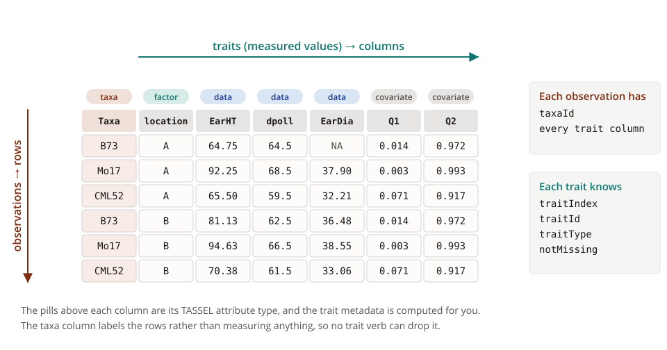

The pills along the top are the attribute types from the table above, one
per column. Alongside them TASSEL computes a small table of metadata for
each trait - which position it holds, what type it is, and how much of it
was measured - and that is what a trait filter asks its questions about.
The row axis has no such summary: a row filter reads the trait values
themselves.


## The verbs
Phenotype data is filtered with the same pipe-friendly **verbs** used on
genotype tables. The verbs are modelled on the `dplyr` package, with one
verb per axis for each of `dplyr::filter()`, `dplyr::select()`, and
`dplyr::slice()`:

| Verb              | Modelled on       | Selects observations/traits by  |
|-------------------|-------------------|---------------------------------|
| `filterTaxa()`    | `dplyr::filter()` | Expressions over trait columns  |
| `selectTaxa()`    | `dplyr::select()` | Taxa IDs and `tidyselect`       |
| `sliceTaxa()`     | `dplyr::slice()`  | Taxon position (1-based)        |
| `filterTraits()`  | `dplyr::filter()` | Expressions over trait metadata |
| `selectTraits()`  | `dplyr::select()` | Trait names and `tidyselect`    |
| `sliceTraits()`   | `dplyr::slice()`  | Trait position (1-based)        |

The `*Taxa()` verbs are the ones you already use on genotype tables. On
phenotype data, `filterTaxa()` keeps observations, while `selectTaxa()` and
`sliceTaxa()` keep whole taxa with every observation they have. The
`*Traits()` verbs are specific to phenotype data and address the column
axis.

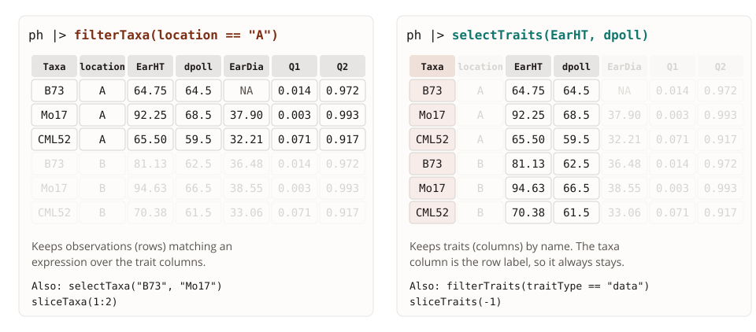

Otherwise the verbs behave as their `dplyr` namesakes do: `filter*()` takes
any number of predicates and combines them with `&`, `select*()` takes the
whole `tidyselect` vocabulary (`all_of()`, `any_of()`, `starts_with()`,
`matches()`, `where()`, ...), and `slice*()` takes positions where a leading
`-` drops instead of keeps. Every verb returns a new object of the same
class it was given and leaves the original untouched.

Genotype tables also offer a bracket (`[`) grammar built from selector
functions. Phenotype data has no bracket grammar: the verbs are the whole
API. On a `TasselGenomicDataset`, `[` addresses the genotype table, as
described in the vignette *Filtering Genotype Tables*.

*Note:* We will be using the base R pipe operator `|>` throughout. More
information about this can be found [here](https://cran.r-project.org/web/packages/magrittr/vignettes/magrittr.html).

**Prior knowledge about `rTASSEL` data structures is needed, so please refer
to the vignette *Getting Started with rTASSEL* if you are new to this
package!**


## A real data set
The illustrations in this vignette all draw the same toy phenotype, called
`ph` in their headers: three taxa measured at two locations, so six
observations of six traits. It is small enough that the effect of each verb
can be read cell by cell.

To see actual output, every example uses the phenotype file shipped with
`rTASSEL`, read in with `readPhenotype()`. It carries all three non-taxa
attribute types - a `factor`, three `data` traits, and three `covariate`
traits:

```{r, eval=TRUE, echo=TRUE}
phenoPath <- system.file("extdata", "mdp_phenotype.txt", package = "rTASSEL")

myPheno <- readPhenotype(phenoPath)
myPheno
```

The type of each column is reported by `attributeData()`, and the trait
names (everything except the taxa column) by `traitNames()`:

```{r, eval=TRUE, echo=TRUE}
attributeData(myPheno)

traitNames(myPheno)
```

Since most taxa were measured at both locations, there are nearly twice as
many observations as taxa. `taxaList()` reports the distinct taxa, and
`as.data.frame()` returns one row per observation:

```{r, eval=TRUE, echo=TRUE}
length(taxaList(myPheno))

nrow(as.data.frame(myPheno))
```

Here is one filter on each axis. The first keeps the observations with an
ear height above 100, and the second keeps a single trait:

```{r, eval=TRUE, echo=TRUE}
myPheno |> filterTaxa(EarHT > 100)
```

```{r, eval=TRUE, echo=TRUE}
myPheno |> selectTraits(EarHT)
```


# Filtering observations...

## Overview
Row criteria are passed to a `*Taxa()` verb. `filterTaxa()` evaluates an R
expression against the phenotype's own columns, one element per
observation, so these are available in that expression:

| Column          | Description                                                  |
|-----------------|--------------------------------------------------------------|
| `taxaId`        | Taxon name, whichever column holds the taxa                  |
| *trait columns* | Every trait, by name (`location`, `EarHT`, `Q1`, ...)        |

`taxaId` is an alias for the taxa column, which TASSEL names `Taxa` when it
reads a file but which keeps whatever name it was given when a phenotype is
built from a `data.frame`. Using the alias means a predicate reads the same
way on any phenotype - and the same way as it does on a genotype table.

Whole taxa are covered by `selectTaxa()` (by ID) and `sliceTaxa()` (by
position).

In the toy phenotype below, each of the three taxa was measured at both
locations, which is what makes the row axis observations rather than taxa:

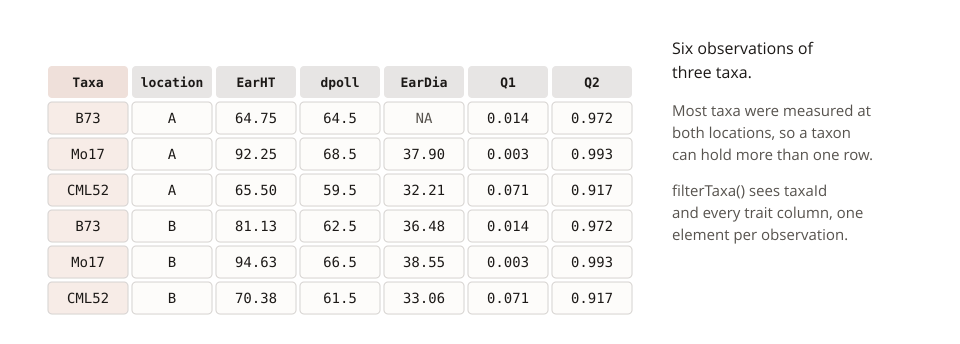


## ...using trait values
A comparison on any numeric trait keeps the observations for which it is
`TRUE`:

```{r, eval=TRUE, echo=TRUE}
myPheno |> filterTaxa(EarHT > 100)
```

Each row is tested on its own, so a replicated taxon can pass on one row
and fail on another. With a lower threshold on the toy phenotype, B73 is
tall enough at location B but not at location A:

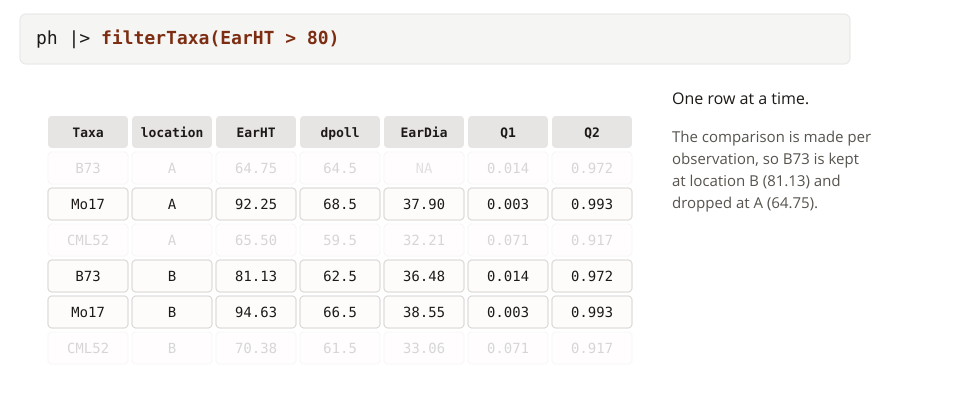

A range is expressed with two comparisons. `filterTaxa()` takes them as
separate arguments and joins them with `&` for you, exactly as
`dplyr::filter()` does:

```{r, eval=TRUE, echo=TRUE}
myPheno |> filterTaxa(EarHT >= 60, EarHT <= 80)
```

Other combinations are written inside a single expression, so an *or* is a
`|`:

```{r, eval=TRUE, echo=TRUE}
myPheno |> filterTaxa(EarHT > 100 | dpoll > 80)
```

The expression is ordinary R evaluated over the whole column, so summary
functions can be part of it. This keeps the observations above the mean ear
height:

```{r, eval=TRUE, echo=TRUE}
myPheno |> filterTaxa(EarHT > mean(EarHT, na.rm = TRUE))
```

Covariates are columns like any other:

```{r, eval=TRUE, echo=TRUE}
myPheno |> filterTaxa(Q3 > 0.9)
```


## ...using factor levels
A `factor` attribute is compared as text. To keep the observations from a
single location:

```{r, eval=TRUE, echo=TRUE}
myPheno |> filterTaxa(location == "A")
```

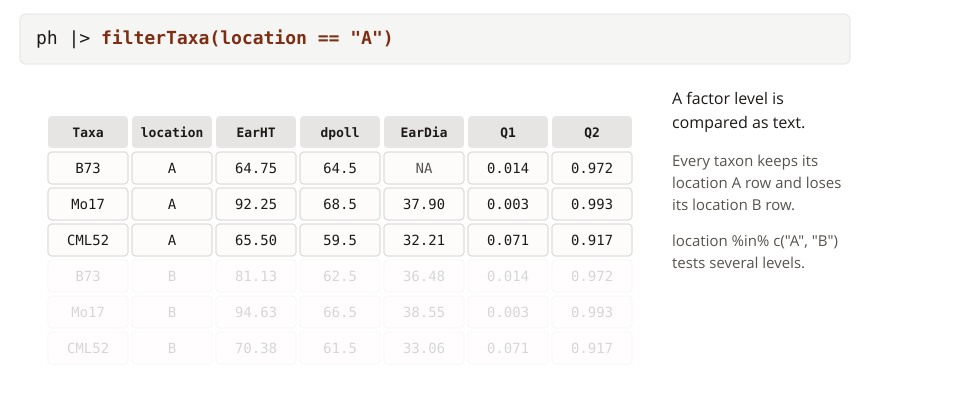

Several levels are tested with `%in%`, as in `filterTaxa(location %in%
c("A", "B"))`.


## ...using missing data
TASSEL records a missing value as `NaN`, which `is.na()` recognises. As in
`dplyr::filter()`, an expression that evaluates to `NA` drops the
observation it was testing, so a comparison on a trait with missing values
silently removes those observations along with the ones that fail the test:

```{r, eval=TRUE, echo=TRUE}
myPheno |> filterTaxa(EarDia > 35)
```

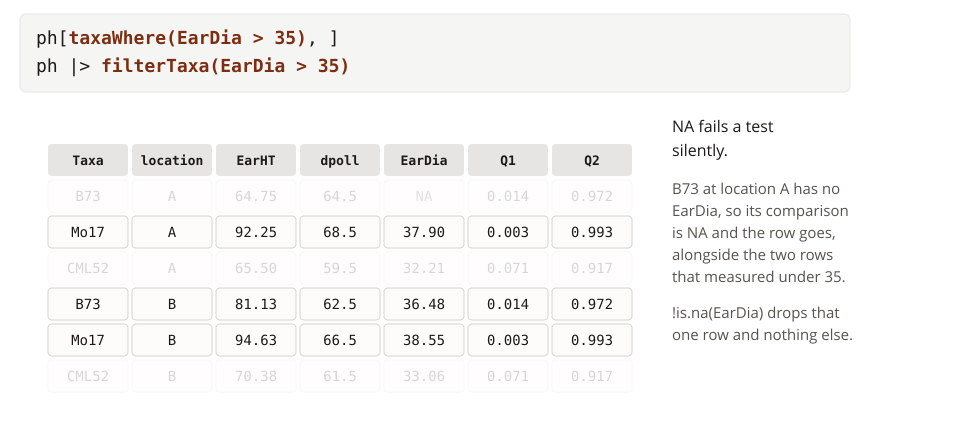

To drop missing observations and nothing else, test for them directly:

```{r, eval=TRUE, echo=TRUE}
myPheno |> filterTaxa(!is.na(EarDia))
```

Listing one such test per trait keeps only the complete cases across those
traits:

```{r, eval=TRUE, echo=TRUE}
myPheno |> filterTaxa(!is.na(EarHT), !is.na(dpoll), !is.na(EarDia))
```

Missing data can also be handled on the trait axis, by dropping the traits
that are missing too often. See *Filtering traits... using missing data*
below.


## ...using taxa IDs
Whole taxa are selected with `selectTaxa()`, which takes literal IDs. Every
observation of a selected taxon is kept, so here two taxa give four rows:

```{r, eval=TRUE, echo=TRUE}
myPheno |> selectTaxa("33-16", "38-11")
```

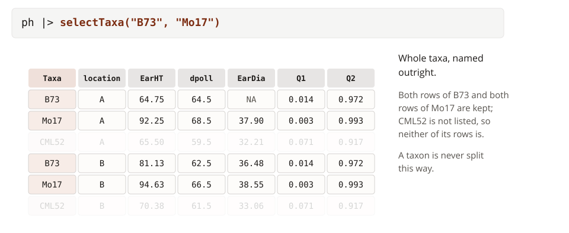

IDs held in a variable are wrapped in `all_of()`, following `tidyselect`,
so that a typo in the variable name cannot be mistaken for a taxon name.
`any_of()` does the same but skips IDs that are not in the phenotype:

```{r, eval=TRUE, echo=TRUE}
myTaxa <- c("33-16", "38-11", "4226")

myPheno |> selectTaxa(all_of(myTaxa))
```

The rest of the `tidyselect` vocabulary is available too, so taxa can be
picked out by pattern:

```{r, eval=TRUE, echo=TRUE}
myPheno |> selectTaxa(starts_with("CML"))
```

Because `taxaId` is in scope for `filterTaxa()`, the same selection can be
written as a predicate. The two are equivalent, since testing the taxon ID
either keeps or drops every observation of that taxon:

```{r, eval=TRUE, echo=TRUE}
myPheno |> filterTaxa(taxaId %in% myTaxa)
```


## ...using taxa positions
`sliceTaxa()` keeps taxa by position, counted as `taxaList()` reports them
and starting from 1. Like `selectTaxa()`, it works a taxon at a time:

```{r, eval=TRUE, echo=TRUE}
myPheno |> sliceTaxa(1:3)
```

The strip on the right of the illustration below is the position each row's
taxon holds in `taxaList()`, which is what `sliceTaxa()` counts:

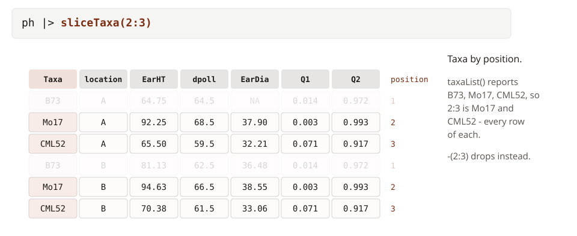

A leading `-` drops instead, so the phenotype without its first three taxa
is:

```{r, eval=TRUE, echo=TRUE}
myPheno |> sliceTaxa(-(1:3))
```

As in `dplyr::slice()`, positive and negative positions cannot be mixed,
and positions past the end are ignored.


## ...using arbitrary expressions
Because `filterTaxa()` evaluates a regular R expression, taxa IDs can be
matched with any function that returns a logical vector:

```{r, eval=TRUE, echo=TRUE}
myPheno |> filterTaxa(startsWith(taxaId, "CML"))
```

For pattern matching on IDs alone, `selectTaxa()` with a `tidyselect`
helper is the shorter spelling, as shown above. `filterTaxa()` is the one
to reach for when the ID is combined with trait criteria in the same call:

```{r, eval=TRUE, echo=TRUE}
myPheno |> filterTaxa(startsWith(taxaId, "CML"), location == "A", !is.na(EarDia))
```


## Observations versus taxa
The distinction between the two kinds of row filter matters whenever taxa
are replicated. `filterTaxa()` tests each observation on its own, so a
taxon can survive on one row and be dropped on another. Our ear height
filter from earlier keeps 15 taxa, but not every measurement of them:

```{r, eval=TRUE, echo=TRUE}
tallEars <- myPheno |> filterTaxa(EarHT > 100)

length(taxaList(tallEars))

nrow(as.data.frame(tallEars))
```

`selectTaxa()` and `sliceTaxa()` never split a taxon this way: a taxon is
either in the result with all of its observations or not in it at all.
If you want the observation-level filter but then need every observation of
the taxa that passed it, select those taxa back out of the original:

```{r, eval=TRUE, echo=TRUE}
myPheno |> selectTaxa(all_of(taxaList(tallEars)))
```

Side by side on the toy phenotype, the two steps are the difference between
keeping the rows that passed and keeping the taxa that passed:

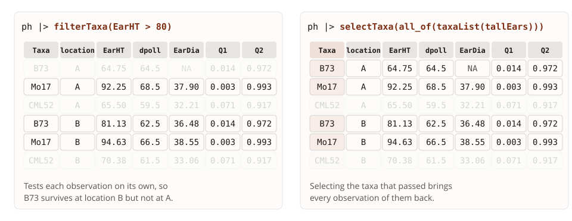


# Filtering traits...

## Overview
Column criteria are passed to a `*Traits()` verb. There are two ways to
describe a trait. `selectTraits()` works from the trait columns themselves,
by name or by value, with the `tidyselect` vocabulary. `filterTraits()`
instead evaluates an R expression against per-trait metadata, and these
columns are available in that expression:

| Column       | Description                                                        |
|--------------|--------------------------------------------------------------------|
| `traitIndex` | 1-based position of the trait                                      |
| `traitId`    | Trait name                                                         |
| `traitType`  | TASSEL attribute type: `"data"`, `"covariate"`, or `"factor"`      |
| `notMissing` | Proportion of observations that are not missing                    |

Positional criteria are covered by `sliceTraits()`.

The taxa column is the axis the observations sit on rather than a trait, so
it is not counted by any of these verbs: it is never offered to
`filterTraits()`, cannot be named in `selectTraits()`, and is not a position
in `sliceTraits()`. Whatever traits are kept, the taxa column stays with
them.

The strips below the toy table are those metadata columns, one value per
trait and nothing under `Taxa`:

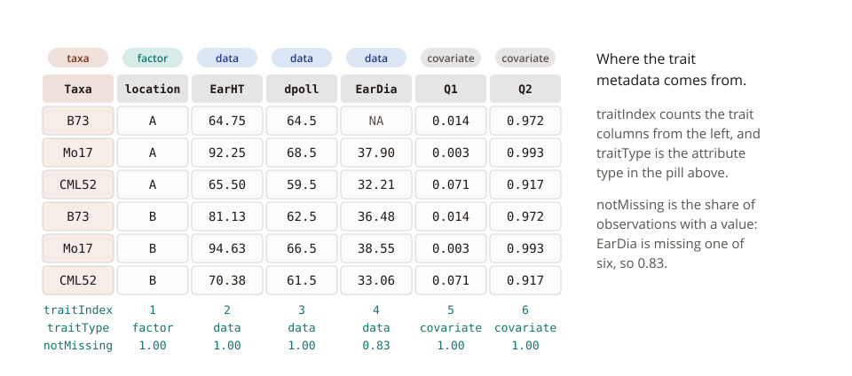


## ...using trait names
Traits can be selected by their literal names with `selectTraits()`:

```{r, eval=TRUE, echo=TRUE}
myPheno |> selectTraits(EarHT, dpoll)
```

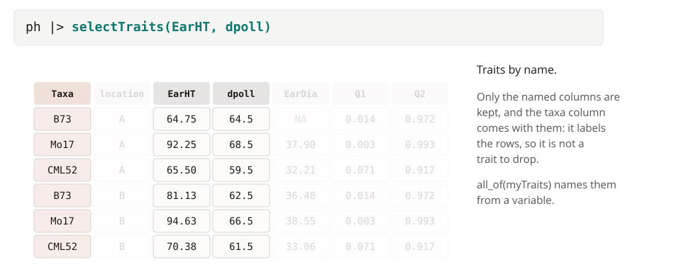

As with taxa, names held in a variable are wrapped in `all_of()` (or
`any_of()` to skip names that are not in the phenotype):

```{r, eval=TRUE, echo=TRUE}
myTraits <- c("EarHT", "dpoll")

myPheno |> selectTraits(all_of(myTraits))
```

Since `selectTraits()` follows `tidyselect`, the helpers that work in
`dplyr::select()` work here. `starts_with()`, `ends_with()`, and
`matches()` select by pattern:

```{r, eval=TRUE, echo=TRUE}
myPheno |> selectTraits(starts_with("Q"))
```

...and a range of adjacent traits is written with `:`:

```{r, eval=TRUE, echo=TRUE}
myPheno |> selectTraits(EarHT:EarDia)
```

Selections can be combined, so a single call can name some traits and match
others:

```{r, eval=TRUE, echo=TRUE}
myPheno |> selectTraits(EarHT, starts_with("Q"))
```


## ...using trait values
`selectTraits()` hands the trait columns themselves to `tidyselect`, not
just their names, so the `where()` helper can pick traits out by their
values. This keeps every numeric trait, which here means everything except
the `location` factor:

```{r, eval=TRUE, echo=TRUE}
myPheno |> selectTraits(where(is.numeric))
```

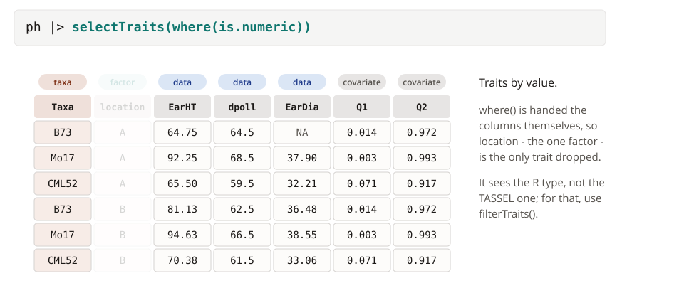

`where()` sees the R representation of each column, as returned by
`as.data.frame()`. To select on the TASSEL attribute type instead, use
`filterTraits()`.


## ...using attribute types
`filterTraits()` describes traits by their metadata. The `traitType` column
holds each trait's TASSEL attribute type, so the population structure
covariates can be pulled out on their own:

```{r, eval=TRUE, echo=TRUE}
myPheno |> filterTraits(traitType == "covariate")
```

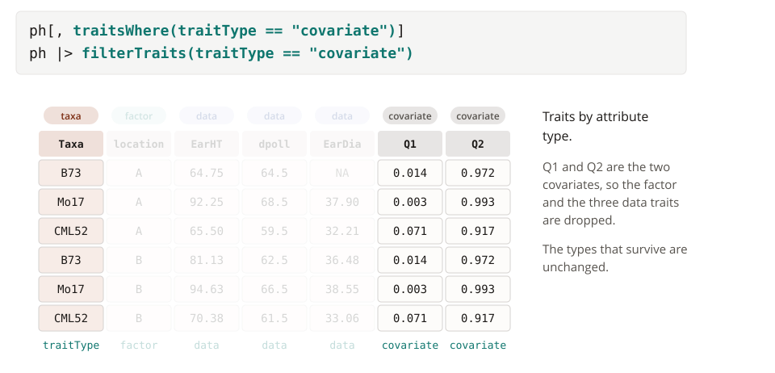

...or everything that is not a covariate:

```{r, eval=TRUE, echo=TRUE}
myPheno |> filterTraits(traitType %in% c("data", "factor"))
```

Attribute types survive filtering untouched, which can be checked with
`attributeData()`:

```{r, eval=TRUE, echo=TRUE}
myPheno |> filterTraits(traitType == "covariate") |> attributeData()
```

`traitId` is also in scope, so a trait can be dropped by name with a
predicate rather than with `-`, and matched by pattern with any function
that returns a logical vector:

```{r, eval=TRUE, echo=TRUE}
myPheno |> filterTraits(traitId != "EarDia")
```


## ...using missing data
The `notMissing` column is the proportion of observations of each trait that
have a value. Since `as.data.frame()` returns the same observations, the
values it holds can be reproduced in R:

```{r, eval=TRUE, echo=TRUE}
phenoDF <- as.data.frame(myPheno)

colMeans(!is.na(phenoDF[traitNames(myPheno)]))
```

`EarDia` is the one trait missing more than 5% of its observations, so this
drops it:

```{r, eval=TRUE, echo=TRUE}
myPheno |> filterTraits(notMissing >= 0.95)
```

In the toy phenotype `EarDia` is the trait with a gap, so the same
threshold drops it there too:

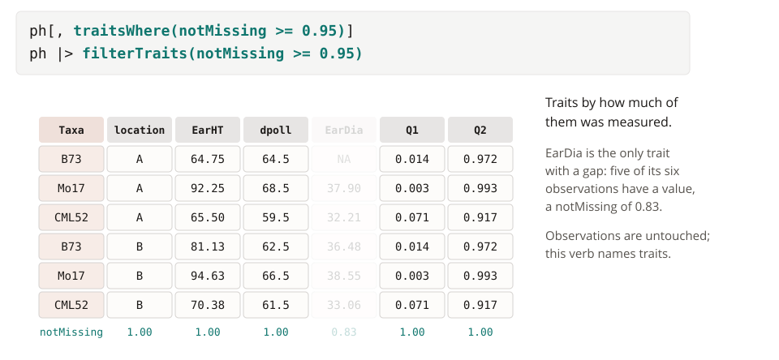

Several predicates are combined with `&`, so criteria on type and
completeness go in one call:

```{r, eval=TRUE, echo=TRUE}
myPheno |> filterTraits(traitType == "data", notMissing >= 0.95)
```


## ...using trait positions
`sliceTraits()` keeps traits by position, counted as `traitNames()` reports
them and starting from 1. The taxa column is not a position, so position 1
is the first trait:

```{r, eval=TRUE, echo=TRUE}
myPheno |> sliceTraits(1:3)
```

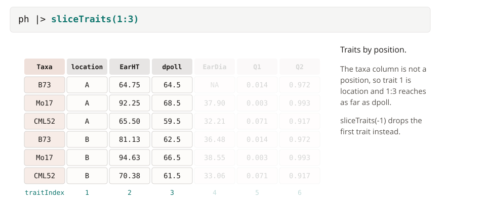

A leading `-` drops:

```{r, eval=TRUE, echo=TRUE}
myPheno |> sliceTraits(-1)
```

`traitIndex` inside `filterTraits()` is the same 1-based position, so
`filterTraits(traitIndex <= 3)` is another way to write `sliceTraits(1:3)`.


## Inverting a selection
The verbs follow `dplyr` for negation. `selectTraits()` and `sliceTraits()`
drop with a leading `-`:

```{r, eval=TRUE, echo=TRUE}
myPheno |> selectTraits(-EarDia)
```

```{r, eval=TRUE, echo=TRUE}
myPheno |> selectTraits(-starts_with("Q"))
```

```{r, eval=TRUE, echo=TRUE}
myPheno |> sliceTraits(-(5:7))
```

`filterTraits()` and `filterTaxa()` negate the predicate itself:

```{r, eval=TRUE, echo=TRUE}
myPheno |> filterTraits(traitType != "covariate")
```

```{r, eval=TRUE, echo=TRUE}
myPheno |> filterTaxa(location != "A")
```

`filterTaxa(!(location == "A"))` is the same query as the last one.


# Combining filters

## Observations and traits in one pipeline
Each verb takes an object and returns one, so the two axes are filtered by
piping one verb into the next:

```{r, eval=TRUE, echo=TRUE}
myPheno |>
    filterTaxa(location == "A", !is.na(EarDia)) |>
    selectTraits(EarHT, dpoll, EarDia)
```

What is left is the intersection of the two steps:

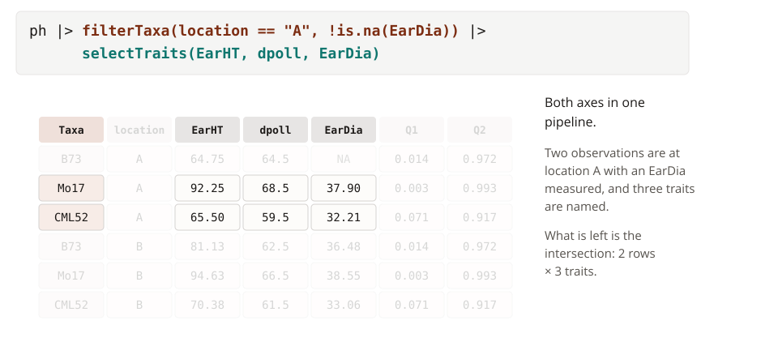

The same verb can appear more than once, and the result of any step can be
saved and reused:

```{r, eval=TRUE, echo=TRUE}
completeCases <- myPheno |>
    filterTaxa(!is.na(EarHT), !is.na(dpoll), !is.na(EarDia))

completeCases |> filterTraits(traitType == "data")
```


## Order matters
Trait metadata is computed from the observations that are in the object at
the time, so filtering observations first changes what `filterTraits()`
sees. On the full phenotype, `notMissing >= 0.95` drops `EarDia`. Once the
observations missing `EarDia` have been removed, the same trait filter keeps
it:

```{r, eval=TRUE, echo=TRUE}
myPheno |>
    filterTraits(notMissing >= 0.95) |>
    traitNames()

myPheno |>
    filterTaxa(!is.na(EarDia)) |>
    filterTraits(notMissing >= 0.95) |>
    traitNames()
```

The `notMissing` strip in the illustration below is what each pipeline sees
when it reaches `filterTraits()`:

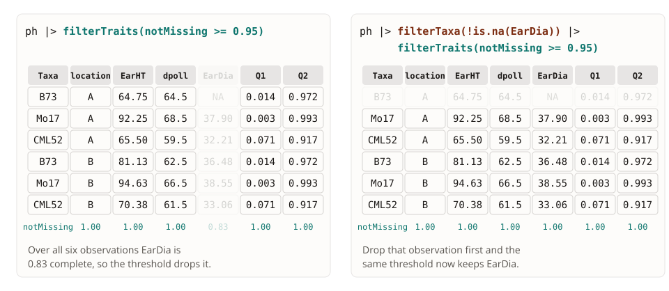

The other way round, a predicate can only name traits that are still
present. To filter observations on a trait you do not want to keep, filter
the observations first and drop the trait second:

```{r, eval=TRUE, echo=TRUE}
myPheno |>
    filterTaxa(location == "A") |>
    selectTraits(-location)
```


## Passing filtered data on
Filtered objects can be passed to any other `rTASSEL` function. The formula
of `assocModelFitter()` already chooses which traits enter a model, so the
trait verbs are not needed for that. They are for changing the object
itself: dropping observations before a model is fit, or leaving a phenotype
with only the columns a later step should see. Here we calculate BLUEs for
two traits from the observations with a complete set of measurements:

```{r, eval=TRUE, echo=TRUE}
myBLUE <- myPheno |>
    filterTaxa(!is.na(EarHT), !is.na(dpoll), !is.na(EarDia)) |>
    selectTraits(location, EarHT, dpoll) |>
    assocModelFitter(
        formula    = . ~ .,
        fitMarkers = FALSE
    )

myBLUE |> tableReport() |> head()
```

Since the verbs return the class they were given, `as.data.frame()` works on
the result as it does on any phenotype:

```{r, eval=TRUE, echo=TRUE}
myPheno |>
    filterTaxa(EarHT > 100) |>
    selectTraits(location, EarHT) |>
    as.data.frame()
```


# Filtering genomic datasets
Everything above applies unchanged to `TasselGenomicDataset` objects, which
hold genotype and phenotype data joined on their shared taxa:


```{r, eval=TRUE, echo=TRUE}
genoPath <- system.file("extdata", "mdp_genotype.hmp.txt", package = "rTASSEL")

myDataset <- readGenomicDataset(genoPath, myPheno)
myDataset
```

The trait verbs act on the phenotype half and leave the genotype table
alone:

```{r, eval=TRUE, echo=TRUE}
myDataset |> selectTraits(EarHT, starts_with("Q"))
```

A dataset has two row axes that `filterTaxa()` could address - the taxa of
the genotype table and the observations of the phenotype - so it reads its
expressions to decide which. Naming a phenotype column filters
observations; anything else filters the genotype table, so the genotype
metrics `notMissing` and `het` described in *Filtering Genotype Tables* keep
their meaning throughout:

```{r, eval=TRUE, echo=TRUE}
# Observations: a phenotype column is named
myDataset |> filterTaxa(EarHT > 100)

# Genotype table: only genotype metadata is named
myDataset |> filterTaxa(notMissing >= 0.9)
```

The two kinds of criteria can be mixed in one call. The genotype metrics are
looked up for the taxon each observation belongs to, so this keeps the
location A observations of taxa with at least 90% of their sites called:

```{r, eval=TRUE, echo=TRUE}
myDataset |> filterTaxa(notMissing >= 0.9, location == "A")
```

Whichever half is filtered, the two are re-joined afterwards, so a taxon
left without any observations is dropped from the genotype table as well:

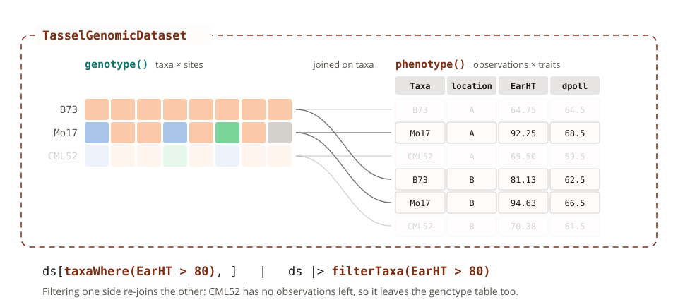

Both halves can be pulled back out with `genotype()` and `phenotype()`:

```{r, eval=TRUE, echo=TRUE}
tallEarsDataset <- myDataset |> filterTaxa(EarHT > 100)

tallEarsDataset |> genotype()

tallEarsDataset |> phenotype()
```

`selectTaxa()` and `sliceTaxa()` mean the same thing on either half, so on a
dataset they are read through the genotype table and give the same result
they would on either component alone.

The phenotype verbs chain with the site verbs, so a dataset can be trimmed
on every axis in one pipeline:

```{r, eval=TRUE, echo=TRUE}
myDataset |>
    filterTaxa(notMissing >= 0.9, location == "A") |>
    selectTraits(EarHT, dpoll, starts_with("Q")) |>
    filterSites(maf >= 0.05)
```

On a phenotype by itself there is no genotype table to compute `notMissing`
or `het` from, so those names are simply not in scope:

```{r, eval=TRUE, echo=TRUE, error=TRUE}
myPheno |> filterTaxa(notMissing >= 0.9)
```

To filter the observations of a phenotype on how complete its *traits* are,
use `!is.na()` in `filterTaxa()` or `notMissing` in `filterTraits()`, as
shown earlier.


# How this lines up with genotype filtering
The phenotype verbs are the genotype verbs applied to a different pair of
axes. If you already filter genotype tables, the table below is the whole
difference:

|                            | Genotype table                                   | Phenotype                                            |
|----------------------------|--------------------------------------------------|------------------------------------------------------|
| Row axis                   | Taxa                                             | Observations (a taxon may appear more than once)     |
| Column axis                | Sites                                            | Traits                                               |
| `filterTaxa()` columns     | `taxaId`, `notMissing`, `het`                    | `taxaId` and every trait column                      |
| `selectTaxa()`, `sliceTaxa()` | Taxa by ID and position                       | Taxa by ID and position, keeping every observation   |
| Column verbs               | `filterSites()`, `selectSites()`, `sliceSites()` | `filterTraits()`, `selectTraits()`, `sliceTraits()`  |
| `filter*()` column metadata | `siteIndex`, `siteId`, `chrom`, `pos`, `maf`, `alleleCount`, `het`, `isIndel`, `isBiallelic` | `traitIndex`, `traitId`, `traitType`, `notMissing` |
| Bracket grammar            | `gt[<taxa>, <sites>]`                            | None; the verbs are the API                          |

One name is shared across the two with different meanings: `notMissing` is
a per-taxon proportion of called sites on a genotype table, and a per-trait
proportion of non-missing observations in `filterTraits()`. On a
`TasselGenomicDataset`, `filterTaxa()` always reads it in the genotype
sense.
