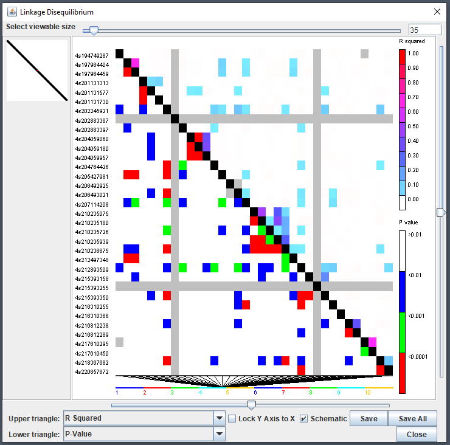

```{r setup, include=FALSE}
library(rTASSEL)

knitr::opts_chunk$set(
    fig.path='figure/graphics-',
    cache.path='cache/graphics-',
    fig.align='center',
    external=TRUE,
    echo=TRUE,
    warning=FALSE
    # fig.pos="H"
)
```


# Introduction

## Overview
Thanks for checking out rTASSEL! In this document, we will go over the
functionalities used to work with the TASSEL software via R.

TASSEL is a software package used to evaluate traits associations, evolutionary
patterns, and linkage disequilibrium. Strengths of this software include:

1. The opportunity for a number of new and powerful statistical approaches to
   association mapping such as a General Linear Model (GLM) and Mixed Linear
   Model (MLM). MLM is an implementation of the technique which our lab's
   published Nature Genetics paper - Unified Mixed-Model Method for
   Association Mapping - which reduces Type I error in association mapping
   with complex pedigrees, families, founding effects and population structure.

2. An ability to handle a wide range of indels (insertion & deletions). Most
   software ignore this type of polymorphism; however, in some species
   (like maize), this is the most common type of polymorphism.

More information can be found in the following paper:

> Bradbury PJ, Zhang Z, Kroon DE, Casstevens TM, Ramdoss Y, Buckler ES. (2007)
> *TASSEL: Software for association mapping of complex traits in diverse samples.* Bioinformatics 23:2633-2635.

Detailed documentation and source code can be found on our website:

https://www.maizegenetics.net/tassel

## Motivation
The main goal of developing this package is to construct an R-based front-end
to connect to a variety of highly used TASSEL methods and analytical tools.
By using R as a front-end, we aim to utilize a *unified* scripting workflow that
exploits the analytical prowess of TASSEL in conjunction with R's popular
data handling and parsing capabilities without ever having the user to switch
between these two environments.

## Disclaimer
Due to the *experimental* nature of this package's lifecycle, end
functionalities are prone to change after end-user input is obtained in the
near future.


## Citation
To cite `rTASSEL`, please use the following citation:

> Monier et al., (2022). rTASSEL: An R interface to TASSEL for analyzing genomic diversity. Journal of Open Source Software, 7(76), 4530, https://doi.org/10.21105/joss.04530


# Preliminary steps

## Setting Memory
Since genome-wide association analyses can use up a lot of computational
resources, memory allocation to `rTASSEL` can be modified. To change the amount
of memory, use the base `options()` function and modify the following parameter:

```{r, eval=FALSE, echo=TRUE}
options(java.parameters = c("-Xmx<memory>", "-Xms<memory>"))
```

Replace `<memory>` with a specified unit of memory. For example, if I want to
allocate a maximum of 6 GB of memory for my operations, I would use the input
`"-Xmx6g"`, where `g` stands for gigabyte (GB). More information about memory
allocation can be found [here](https://stackoverflow.com/questions/14763079/what-are-the-xms-and-xmx-parameters-when-starting-jvm).

**NOTE:** Setting Java memory options for `rTASSEL` and any `rJava`-related packages
*needs* to be set *before* loading the `rTASSEL` package!

## The importance of logging your progress
Before we begin analyzing data, optional parameters can be set up to make
`rTASSEL` more efficient. To prevent your R console from being overloaded with
TASSEL logging information, **it is highly recommended that you start a logging
file**. This file will house all of TASSEL's logging output which is
beneficial for debugging and tracking the progress of your analytical workflow.
To start a logging file, use the following command:

```{r, eval=FALSE, echo=TRUE}
startLogger()
```

If the `startLogger()` file path is set to `NULL`, the logging file
will be created in your current working directory. If you are unsure of what
your working directory is in R, use the base `getwd()` command.


Additionally, since this is a general walkthrough, certain intricaces of each
function may glossed over. If you would like to study a function in full,
refer to the R documentation by using `?<function>` in the console, where
`<function>` is an `rTASSEL`-based function.


# Reading Data

## Overview
Like TASSEL, `rTASSEL` will read two main types of data:

* Genotype data
* Phenotype data

This data can be read in several different ways. In the following examples,
we will demonstrate various ways genotype and phenotype information can be
loaded into `rTASSEL` objects.


## Loading genotype data

### From a path
Currently, reading in genotype data to `rTASSEL` is based off of file
locations as paths. Genotype/sequencing data can be stored in a variety of
formats. `rTASSEL` can read and store a wide variety of file types:

* hapmap (HMP)
* HDF5 (hierarchical data format version 5)
* VCF (variant call format)
* Plink

To load this genotype data, simply store your file location as a string object
in R. For this example, we will load two toy data sets - one being a VCF file
and the other being a hapmap file. These data sets can be accessed via the
`rTASSEL` package itself:

```{r, eval=TRUE, echo=TRUE}
# Load hapmap data
genoPathHMP <- system.file(
    "extdata",
    "mdp_genotype.hmp.txt",
    package = "rTASSEL"
)
genoPathHMP

# Load VCF data
genoPathVCF <- system.file(
    "extdata",
    "maize_chr9_10thin40000.recode.vcf",
    package = "rTASSEL"
)
genoPathVCF
```

Now that we have the file paths to this data, we can pass this to TASSEL and
create a formal `TasselGenotypePhenotype` class object in R using the
following:

```{r, eval=TRUE, echo=TRUE}
# Load in hapmap file
tasGenoHMP <- readGenotypeTableFromPath(
    path = genoPathHMP
)

# Load in VCF file
tasGenoVCF <- readGenotypeTableFromPath(
    path = genoPathVCF
)
```

When we call these objects, a summary of the data will be posted to the R
console:

```{r, eval=TRUE, echo=TRUE}
tasGenoHMP
```

This summary details the number of Taxa (`Taxa`) and marker positions
(`Positions`) within the data set. Additionally, since we can load both
genotype and phenotype information into this object, a helpful check will be
displayed to show what is populating the object (`[x] or [ ]`).

### Additional information about TasselPhenotypeGenotype data sets
In general, this S4 class data object houses "slot" information relating to
TASSEL/Java pointers of the respective data.

```{r, eval=TRUE, echo=TRUE}
class(tasGenoHMP)
slotNames(tasGenoHMP)
```

Technically, this object does not contain the full information of the data
represented in R space, but merely contains addresses to the memory store of
the reference TASSEL object ID. For example, if we wanted to extract the
`GenotypeTable` with the S4 `@` operator, we would get something that looks
like this:

```{r, eval=TRUE, echo=TRUE}
tasGenoHMP@jGenotypeTable
```

This entity is a `rJava` internal identifier. It isn't until we call
downstream `rTASSEL` functions where we will bring the TASSEL data into the R
environment.


## Loading phenotype data

### From a path
Similar to reading in genotype data, phenotype data can also be read in via
paths. If you already have preconstructed phenotype data in a file, this
option will most likely work best for you. One caveat to this is how the
data file is constructed in terms of columns and trait data for TASSEL
analyses. More information about how these files can be found at this
[link](https://bitbucket.org/tasseladmin/tassel-5-source/wiki/UserManual/Load/Load)
under the *Numerical Data* section.

Loading this type of data is very similar to how genotype data is loaded.
here, we will use the `readPhenotypeFromPath()` function:

```{r, eval=TRUE, echo=TRUE}
# Read from phenotype path
phenoPath  <- system.file("extdata", "mdp_traits.txt", package = "rTASSEL")
phenoPath

# Load into rTASSEL `TasselGenotypePhenotype` object
tasPheno <- readPhenotypeFromPath(
    path = phenoPath
)

# Inspect object
tasPheno
```

The object output is very similar to the genotype table output with some minor
additions to which traits are displayed in the file.

### From an R data frame
In some cases you might want to first modify your phenotype data set in R and
then load it into the TASSEL environment. If you wish to choose this route, you
will need to use the `readPhenotypeFromDataFrame()` function along
with a couple of parameters. First, we will construct an R data frame and load
it with this function:

```{r, eval=TRUE, echo=TRUE}
# Create phenotype data frame
phenoDF <- read.table(phenoPath, header = TRUE)
colnames(phenoDF)[1] <- "Taxon"

# Inspect first few rows
head(phenoDF)

# Load into rTASSEL `TasselGenotypePhenotype` object
tasPhenoDF <- readPhenotypeFromDataFrame(
    phenotypeDF = phenoDF,
    taxaID = "Taxon",
    attributeTypes = NULL
)

# Inspect new object
tasPhenoDF
```

The `phenotypeDF` parameter is for the R data frame object. The `taxaID`
parameter is needed to determine which column of your data frame is your
TASSEL taxa data. The final parameter (`attributeTypes`) is optional. If this
parameter is set to `NULL`, all remaining data frame columns will be classified
as TASSEL `data` types. If this is not the case for your data (e.g. if you
have covariate or factor data in your experiment), **you will need to
specify which columns are what TASSEL data type** (i.e. `data`, `covariate`,
or `factor`). This will have to be passed as an R vector of string elements
(e.g. `c("data", "factor", "covariate")`). *Currently*, this data type needs to
be entered in the same order as they are found in the data frame.


## Loading genotype and phenotype data simultaneously
In association studies, we are interested in combining our genotype and
phenotype data. To usually run this operation in TASSEL, an intersect
combination between the two data sets is needed. To run this in `rTASSEL`, we
can use the `readGenotypePhenotype()` function. The parameter input
needed for this function is, of course, a genotype and phenotype object. For
genotype input, the following can be used:

* a path to a genotype file
* a prior `TasselGenotypePhenotype` object

For phenotype input, the following can be used:

* a path to a phenotype data set,
* a prior `TasselGenotypePhenotype` object
* an R data frame

For example, if we wanted to read the prior `TasselGenotypePhenotype`
genotype and phenotype objects from earlier:

```{r, eval=TRUE, echo=TRUE}
tasGenoPheno <- readGenotypePhenotype(
    genoPathOrObj = tasGenoHMP,
    phenoPathDFOrObj = tasPheno
)
tasGenoPheno
```

We can also use a combination of the above parameter options (e.g. load a
genotype path and a phenotype data frame, etc.). One caveat though, **if you
load in a phenotype data frame object with this function, the prior parameters
from the** `readPhenotypeFromDataFrame` **will be needed** (i.e. the
`taxaID` and `attributeTypes` parameters):

```{r, eval=TRUE, echo=TRUE}
tasGenoPhenoDF <- readGenotypePhenotype(
    genoPathOrObj = genoPathHMP,
    phenoPathDFOrObj = phenoDF,
    taxaID = "Taxon",
    attributeTypes = NULL
)
tasGenoPhenoDF
```


## Reading kinship data
rTASSEL also provides users the ability to read in delimited "flat-file" 
kinship objects as a `TasselDistanceMatrix` object using the function,
`readTasselDistanceMatrix()`:

```{r, eval=TRUE, echo=TRUE}
## Get toy kinship data from package ----
kinshipPath <- system.file(
  "extdata", 
  "mdp_kinship.txt", 
  package = "rTASSEL"
)

## Read ----
readTasselDistanceMatrix(kinshipPath)
```


## Reading numeric genotype data
TASSEL 5 also has the ability to read in matrix-like genotype data where instead
of reported allele states, probability values between 0 and 1 for a given 
reference state are reported. These are classified as `NumericGenotypes` and
can behave in similar fashion to standard allele-based genotype objects for
analyses like association (e.g., TWAS). We can read this data in two ways:

* From a file (TASSEL 5-formatted `<Numeric>` data):

  ```
  <Numeric>
  <Marker> m1  m2   m3
  line_a   0   0.5  0.2
  line_b   1   0    0.123
  line_c   1   0.3  0.1415
  ```

* From a formatted R matrix

### Read numeric data from file
Like other genotype files, we can read this in via `readGenotypeTableFromPath()`:

```{r, eval=TRUE, echo=TRUE}
numGtPath <- system.file("extdata", "numeric_genotype.txt", package = "rTASSEL")
numGt <- readGenotypeTableFromPath(numGtPath)

numGt
```

### Read numeric data from matrix
To read from an already existing R matrix, make sure that it formatted
properly with row and column names. In the following example, I will make
a function that will simulate an example R matrix with values between 0 and 1.

```{r, eval=TRUE, echo=TRUE}
# Simulate numeric matrices
simNumericGt <- function(nRow, nCol) {
    # Matrix values
    minMax <- function(x) (x - min(x)) / (max(x) - min(x))
    d <- rnorm(nCol * nRow) |> minMax()
    m <- matrix(d, nrow = nRow, ncol = nCol)

    # Taxa values
    taxa <- sprintf("line_%02d", seq_len(nRow))

    # Position values
    mIds <- sprintf("marker_%02d", seq_len(nCol))
    mPos <- seq_len(nCol)

    # Add IDs to matrix
    colnames(m) <- mIds
    rownames(m) <- taxa

    return(m)
}

# Simulate a matrix with 5 taxa and 10 sites
simMat <- simNumericGt(5, 10)

# Inspect the first 3 rows and columns
simMat[1:3, 1:3]
```

Once properly formatted, you read and evaluate this using the 
`readNumericGenotypeFromRMatrix()` function:

```{r, eval=TRUE, echo=TRUE}
numGt <- readNumericGenotypeFromRMatrix(simMat)

numGt
```


# Converting TASSEL 5 data into R objects

## Convert genotype data
To convert a TASSEL 5 genotype table into an R `matrix` object, you can use
base R's `as.matrix()` function. This will by deafault, return a **dosage
matrix** where dosage is the number of alternative alleles present for a
given taxa and site element:

```{r, eval=TRUE, echo=TRUE}
gtMat <- as.matrix(tasGenoPheno)

# Show first 10 rows and 4 columns
gtMat[1:10, 1:4]
```


## Convert phenotype data
If you want to bring in phenotype data into the R environment, you can use
the `getPhenotypeDF()` function. All this function needs
is a `TasselGenotypePhenotype` class object *containing a phenotype table*:

```{r, eval=TRUE, echo=TRUE}
tasExportPhenoDF <- getPhenotypeDF(tasObj = tasGenoPheno)

head(tasExportPhenoDF)
```

As shown above, an R `tibble`-based data frame is exported with converted
data types translated from TASSEL. See the following table what TASSEL data
types are tranlated into within the R environment:

| TASSEL Data | Converted R Data type |
|:------------|:----------------------|
| taxa        | character             |
| data        | numeric               |
| covariate   | numeric               |
| factor      | factor                |


# Filtering genotype data

**NOTE**: This is just a "snapshot" of how we can filter genotype information
in rTASSEL. For more information, please see the additional vignette, 
*"Filtering Genotype Tables"*.

Prior to association analyses, filtration of genotype data may be necessary.
In TASSEL, this accomplished through the Filter menu using two primary plugins:

* Filter Site Builder plugin
* Filter Taxa Builder plugin

In `rTASSEL`, this can also be accomplished using the follwing functions:

* `filterGenotypeTableSites()`
* `filterGenotypeTableTaxa()`

These objects take a `TasselGenotypePhenotype` class object. For example, in
our genotype data set, if we want to remove monomorphic and low coverage sites,
we could use the following parameters in `filterGenotypeTableSites()`:

```{r, eval=TRUE, echo=TRUE}
tasGenoPhenoFilt <- filterGenotypeTableSites(
    tasObj = tasGenoPheno,
    siteMinCount = 150,
    siteMinAlleleFreq = 0.05,
    siteMaxAlleleFreq = 1.0,
    siteRangeFilterType = "none"
)
tasGenoPhenoFilt
```

We can then compare this to our original pre-filtered data set:

```{r, eval=TRUE, echo=TRUE}
tasGenoPheno
```

These functions can work on any `TasselGenotypePhenotype` class object that
contains genotypic data, regardless of single or combined TASSEL objects.


# Analysis - Relatedness

## Create a kinship matrix object
In TASSEL, for mixed linear model analyses, a kinship matrix calculated from
genotype data is necessary. This can be accomplished by calculating a kinship
TASSEL object using the function `kinshipMatrix()`. The main
parameter input is a `TasselGenotypePhenotype` class object that contains a
genotype data set:

```{r, eval=TRUE, echo=TRUE}
tasKin <- kinshipMatrix(tasObj = tasGenoPheno)
```

This function allows for several types of algorithm to used using the `method`
parameter. More info about these methods can be found
[here](https://bitbucket.org/tasseladmin/tassel-5-source/wiki/UserManual/Kinship/Kinship).


## Calculate a distance matrix
Very similar to kinship matrix calculation, a distance matrix can also be
calculated using genotype data using the function `distanceMatrix()`:

```{r, eval=TRUE, echo=TRUE}
tasDist <- distanceMatrix(tasObj = tasGenoPheno)
```


## `TasselDistanceMatrix` objects

### Overview
The prior two functions will generate a pairwise matrix (e.g. $m \times m$ 
dimensions). The return object is an rTASSEL class, `TasselDistanceMatrix`.
When we inspect the prior object we will see something like this:

```{r, eval=TRUE, echo=TRUE}
tasKin
```

This will showcase the first four rows and columns and the last row and column
if the distance matrix exceeds 5 dimensions (*which it probably will*).

This object, similar to the `TasselGenotypePhenotype` class, essentially holds
pointers to the Java/TASSEL object in memory. Despite this, we can still use
some base R methods similar to how we handle `matrix` objects:

```{r, eval=TRUE, echo=TRUE}
tasKin |> colnames() |> head()
tasKin |> rownames() |> head()

tasKin |> dim()

tasKin |> nrow()
tasKin |> ncol()
```

### Coercion
If we want to use additional R methods (e.g. plotting, new models, etc.), we
can coerce this object to a general R data object, in this case, a `matrix`
object using the base method `as.matrix()`:

```{r, eval=TRUE, echo=TRUE}
tasKinR <- tasKin |> as.matrix()

## Inspect first 5 rows and columns ----
tasKinR[1:5, 1:5]
```

We can also coerce a pairwise `matrix` object to a `TasselDistanceMatrix` 
object using rTASSEL's function `asTasselDistanceMatrix()`:

```{r, eval=TRUE, echo=TRUE}
## Create a dummy pairwise matrix object ----
set.seed(123)
m <- 10
s <- matrix(rnorm(100), m)
s[lower.tri(s)] <- t(s)[lower.tri(s)]
diag(s) <- 2

## Add sample IDs ----
colnames(s) <- rownames(s) <- paste0("s_", seq_len(m))

testTasselDist <- s |> asTasselDistanceMatrix()
testTasselDist
```


## PCA and MDS
rTASSEL can run principal component analysis (PCA) and multidimensional
scaling (MDS) on objects containing a `GenotypeTable` and 
`TasselDistanceMatrix` respectively. To run PCA, simply use the `pca()` 
function on a `TasselGenotypePhenotype` object that contains a TASSEL
`GenotypeTable`

```{r, eval=TRUE, echo=TRUE}
tasGenoHMP

pcaRes <- pca(tasGenoHMP)
```


To run MDS, simply use the `mds()` function on a `TasselDistanceMatrix` object:

```{r, eval=TRUE, echo=TRUE}
tasDist

mdsRes <- mds(tasDist)
```


Both of these will return a `DataFrame` object that will contain a Taxa ID
column and the number of components or axes that were specified in the
function call. For example, let's take a look at the `pcaRes` object made
previously:

```{r, eval=TRUE, echo=TRUE}
pcaRes
```


### `PCAResults` Table reports
The returned object from running `pca()` is a `PCAResults` object. This is a
collection of TASSEL 5 table report results that are generated for a given
genotype object. We can access the default principal component data using the
`tableReport()` function. I will use base R's piping operator (`|>`) to better 
show the flow of methods: :

```{r, eval=TRUE, echo=TRUE}
# Return principal components
pcaRes |> tableReport() |> head()
```

We can also obtain other reports from the object by specifying the name of the
report. The names of the reports are listed in the object's display but we can
also return them using `reportNames()`

```{r, echo=TRUE, eval=TRUE}
pcaRes |> reportNames()
```

```{r, echo=TRUE, eval=TRUE}
pcaRes |> tableReport("Eigenvalues_Datum") |> head()
```


# Analysis - Association

## Overview
One of TASSEL's most powerful functionalities is its capability of performing
a variety of different association modeling techniques. If you have started
reading the walkthrough here it is *strongly suggested that you read the other
components of this walkthrough since the following parameters require what we
have previously created!*

If you are not familar with these methods, more information about how
these operate in base TASSEL can be found at following links:

* [BLUE/GLM](https://bitbucket.org/tasseladmin/tassel-5-source/wiki/UserManual/GLM/GLM)
* [MLM](https://bitbucket.org/tasseladmin/tassel-5-source/wiki/UserManual/MLM/MLM)
* [Fast Association](https://bitbucket.org/tasseladmin/tassel-5-source/wiki/UserManual/FastAssociation/FastAssociation)

The `assocModelFitter()` function has several primary components:

* `tasObj`: a `TasselGenotypePhenotype` class R object
* `formula`: an R-based linear model formula
* `fitMarkers`: a boolean parameter to differentiate between BLUE and GLM
  analyses
* `kinship`: a TASSEL kinship object
* `fastAssociation`: a boolean parameter for data sets that have many traits


### Formula syntax

Probably the most important concept of this function is `formula` parameter.
If you are familar with standard R linear model functions, this concept is
fairly similar. In TASSEL, a linear model is composed of the following scheme:

```
y ~ A
```

...where `y` is any TASSEL `data` type and `A` is any TASSEL `covariate`
and / or `factor` types:

```
<data> ~ <covariate> and/or <factor>
```

This model can be written out in several ways. With the given phenotype example
data, we can have the following variables that are represented in TASSEL in the
following way:

| Trait     | Type          |
|-----------|---------------|
| `Taxon`   | `<taxa>`      |
| `dpoll`   | `<data>`      |
| `EarDia`  | `<data>`      |
| `EarHT`   | `<data>`      |
| `location`| `<factor>`    |
| `Q1`      | `<covariate>` |
| `Q2`      | `<covariate>` |
| `Q3`      | `<covariate>` |


Using this data, we could write out the following formula in R

```
c(EarHT, dpoll, EarDia) ~ location + Q1 + Q2 + Q3
```

In the above example, we use the base `c()` function to indicate analysis
on multiple numeric data types. For covariate and factor information, we can use
the addition (`+`) operator. One problem with this implementation is that it can 
become cumbersome and prone to error if we want to analyze the entirety of a large
data set or all data and/or factor and covariate types.

A work around for this problem is to utilize a special character to indicate
all elements within the model (`.`). By using the `.` operator we can simplify
the above model into the following:

```
. ~ .
```

This indicates we want to analyze *the whole* data set and leave nothing out.
If we want to analyze all data types and only a handful of factor and/or
covariates, we can use something like this:

```
. ~ location + Q1 + Q2
```

Or vice-versa:

```
c(EarHT, dpoll) ~ .
```

In some instances, we may want to keep all data except for a few response or
predictor types in the formula. Instead of writing out all variables that we
want to include, we can write the exclusionary inverse by leveraging the minus
(`-`) operator. For example, if we want to keep all data, covariate and factor 
types from the prior data set **except** the `Q3` covariate, we can use the 
following:

```
. ~ . - Q3
```

Another example of exclusion would be to drop all traits of one TASSEL type
(i.e., drop all factor or covariate data from the model). If our models contain
many of one specific type, this can also become cumbersome and error prone
when writing out the model. To circumvent this, rTASSEL includes a special set
of "whitelisted" keywords that we can use to drop specific trait types:

* `I(cov)`: all traits of type "covariate"
* `I(fct)`: all traits of type "factor"

Using the prior example, if we want to keep all factor traits but remove all
covariate traits (e.g., `Q1`, `Q2`, and `Q3`), we can use the following:

```
. ~ . - I(cov)
```

For more examples of how to subset phenotype data take a look the following
table:

| Formula                             | Data                        | Covariate         | Factor     |
|-------------------------------------|-----------------------------|-------------------|------------|
| `. ~ .`                             | `dpoll`, `EarDia`, `EarHT`  | `Q1`, `Q2`, `Q3`  | `location` |
| `EarHT ~ . - Q2`                    | `EarHT`                     | `Q1`, `Q3`        | `location` |
| `. - dpoll ~ . - Q1 - Q3`           | `EarHT`, `EarDia`           | `Q2`              | `location` |
| `c(dpoll, EarHT) ~ Q1 + location`   | `dpoll`, `EarHT`            | `Q1`              | `location` |
| `dpoll + EarHT ~ Q1 + location`     | `dpoll`, `EarHT`            | `Q1`              | `location` |
| `dpoll ~ . - I(cov)`                | `dpoll`                     | _None_            | `location` |
| `. - dpoll ~ Q2 - Q1 - Q3`          | `EarHT`, `EarDia`           | `Q2`              | _None_     |
| `. - dpoll ~ -Q1 - Q3 + Q2`         | `EarHT`, `EarDia`           | `Q2`              | _None_     |
| `dpoll ~ -I(cov) + .`               | `dpoll`                     | _None_            | `location` |


### Other parameters

Additionally, we can also fit marker and kinship data to our model which can
change our analytical methods. Since these options in TASSEL are binary,
additional parameters are passed for this function. In this case,
genotype/marker data is fitted using the `fitMarker` parameter and kinship is
fitted using the `kinship` parameter.

Fast Association implements methods described by Shabalin (2012). This method
provides an ordinary least squares solution for fixed effect models. For this
method to proper work it is necessary that your have:

* *No missing data in your phenotype data set*
* *Phenotypes and genotypes have been merged using an intersect join*. Since
  this is currently the only option of join genotype and phenotype data, you
  do not have to worry about this *for now*.

**NOTE**: since we are working with "toy" data, empirical insight will not
be elucidated upon in the following steps. This is simply to show the user how
properly use these functions and the outputs that they give.

In the following examples, we will run example data and in return, obtain
TASSEL association table reports in the form of an R `list` object containing
`tibble`-based R data frames.


## Calculate BLUEs
To caclulate best linear unbiased estimates (BLUEs), numeric phenotype data
can be used along with covariate and factor data *only* if it is intended to
control for field variation. Since genotype data is not needed for this
method, we can leave the `fitMarkers`, `kinship`, and `fastAssociation` to
`NULL` or `FALSE`:

```{r, echo=TRUE, eval=TRUE}
# Read in phenotype data
phenoPathCov <- system.file("extdata", "mdp_phenotype.txt", package = "rTASSEL")
tasPhenoCov <- readPhenotypeFromPath(phenoPathCov)

# Calculate BLUEs
tasBLUE <- assocModelFitter(
    tasObj = tasPhenoCov,
    formula = . ~ .,                  # <- All data is used!
    fitMarkers = FALSE,
    kinship = NULL,
    fastAssociation = FALSE
)

# Inspect results
tasBLUE
```

### `AssociationResults` Table reports
In the prior example, we see that `assocModelFitter()` will return a
`AssociationResults` object. You can think of this object as an R list that
contains TASSEL 5 table report information encoded as a `data.frame`-like
object. To access the primary report you can apply the `tableReport()` function
to the object. In the following examples, I will use base R's piping operator
(`|>`) to better show the flow of methods:

```{r, echo=TRUE, eval=TRUE}
# Return BLUE values for traits
tasBLUE |> tableReport() |> head()
```

We can also obtain other reports from the object by specifying the name of the
report. The names of the reports are listed in the object's display but we can
also return them using `reportNames()`

```{r, echo=TRUE, eval=TRUE}
tasBLUE |> reportNames()
```

```{r, echo=TRUE, eval=TRUE}
# Return ANOVA results
tasBLUE |> tableReport("BLUE_ANOVA") |> head()
```


## Calculate GLM
Similar to BLUEs, we can fit a generalized linear model (GLM) by simply
fitting marker data to our model. For this, we need a genotype data set
combined with our phenotype data in a `TasselGenotypePhenotype` class object:

```{r, echo=TRUE, eval=TRUE}
# Calculate GLM
tasGLM <- assocModelFitter(
    tasObj = tasGenoPheno,          # <- our prior TASSEL object
    formula = c(EarHT, dpoll) ~ .,  # <- only EarHT and dpoll are ran
    fitMarkers = TRUE,              # <- set this to TRUE for GLM
    kinship = NULL,
    fastAssociation = FALSE
)

# Inspect results
tasGLM
```

```{r, echo=TRUE, eval=TRUE}
# Return association statistics
tasGLM |> tableReport() |> head()
```


## Calculate MLM
Adding to our complexity, we can fit a mixed linear model (MLM) by adding
kinship to our analysis. In addition to the prior parameters, we will also
need a TASSEL kinship object (see *Create a kinship matrix object* in the
*Analysis - Relatedness* section):

```{r, echo=TRUE, eval=TRUE}
# Calculate MLM
tasMLM <- assocModelFitter(
    tasObj = tasGenoPheno,             # <- our prior TASSEL object
    formula = EarHT ~ .,               # <- run only EarHT
    fitMarkers = TRUE,                 # <- set this to TRUE for GLM
    kinship = tasKin,                  # <- our prior kinship object
    fastAssociation = FALSE
)

# Inspect results
tasMLM
```


## Calculate Fast Association
We can run fast association analysis in our GLM model by setting
the `fastAssociation` parameter to `TRUE`. **NOTE**: this is only really
effective if you have many phenotype traits:

```{r, echo=TRUE, eval=TRUE}
# Read data - need only non missing data!
phenoPathFast <-system.file(
    "extdata",
    "mdp_traits_nomissing.txt",
    package = "rTASSEL"
)

# Creat rTASSEL object - use prior TASSEL genotype object
tasGenoPhenoFast <- readGenotypePhenotype(
    genoPathOrObj = tasGenoHMP,
    phenoPathDFOrObj = phenoPathFast
)


# Calculate MLM
tasFAST <- assocModelFitter(
    tasObj = tasGenoPhenoFast,         # <- our prior TASSEL object
    formula = . ~ .,                   # <- run all of the phenotype data
    fitMarkers = TRUE,                 # <- set this to TRUE for GLM
    kinship = NULL,
    fastAssociation = TRUE             # <- set this to TRUE for fast assoc.
)

# Inspect results
tasFAST
```


## Calculate Stepwise Regression
Additionally, we can also run stepwise regression via TASSEL 5's 
`StepwiseOLSModelFitterPlugin` using the `stepwiseModelFitter()` function with 
similar formula syntax found in the prior sections:

```{r, echo=TRUE, eval=TRUE}
stepRes <- stepwiseModelFitter(
    tasObj  = tasGenoPhenoFast,
    formula = dpoll ~ .
)

# Inspect results
stepRes
```


# Analysis - Phylogeny
`rTASSEL` allows for interfacing with TASSEL's tree generation methods from
genotype information. This can be performed using the `createTree()` method
with a `TasselGenotypePhenotype` object containing genotype table information:

```{r, echo=TRUE, eval=TRUE}
phyloTree <- createTree(
    tasObj = tasGenoHMP,
    clustMethod = "Neighbor_Joining"
)
```

The above function allows for two clustering methods:

* `Neighbor_Joining` - Neighbor Joining method. More info can be found
  [here](https://en.wikipedia.org/wiki/Neighbor_joining)
* `UPGMA` - **U**nweighted **P**air **G**roup **M**ethod with **A**rithmetic 
  **M**ean. More info can be found [here](https://en.wikipedia.org/wiki/UPGMA).

Upon creation, the `phyloTree` object is returned as a `phylo` object generated
by the [ape](https://cran.r-project.org/web/packages/ape/ape.pdf) package:

```{r, echo=TRUE, eval=TRUE}
phyloTree
```

This object can then be used by common base-R methods (e.g. `plot()`) or other
visualization libraries such as
[ggtree](https://bioconductor.org/packages/release/bioc/html/ggtree.html).


# Visualizations

## Overview
`rTASSEL` supports a wealth of information rich and easily generated plots via
the `plot*` family of functions. In the following sections, we will briefly
go over some of the capabilities.

## Manhattan plots
To generate Manhattan plots from GWAS data, we can use the `plotManhattan()`
function. To make this as streamlined as possible, we can pass our prior
`AssociationResults` objects to the default plotting function:

```{r, echo=TRUE, eval=TRUE}
tasGLM |> plotManhattan()
```

Since we mapped 2 traits, the resulting plot will have 2 facets: 1 row for
each trait. We can also specify a singular trait or a collection of traits by
passing a singular `character` object or a collection (i.e., `c()`) of 
`character` objects, respectively, into the `trait` parameter:

```{r, echo=TRUE, eval=TRUE, fig.height=2.5, fig.width=12}
tasGLM |> plotManhattan(trait = "dpoll")
```

We can also set a threshold value to highlight visually "significant" markers
of interest by passing a $-log_{10}$ value to the `threshold` parameter:

```{r, echo=TRUE, eval=TRUE}
tasGLM |> plotManhattan(threshold = 5)
```

We pass different colors for column facets by passing color values to the 
`colors` parameter:

```{r, echo=TRUE, eval=TRUE}
tasGLM |> plotManhattan(colors = c("red", "#4890bd", "#2ad14e"))
```


We can also make plots interactive by setting the `interactive` parameter to
`TRUE`:

```{r, echo=TRUE, eval=TRUE}
tasGLM |> plotManhattan(interactive = TRUE)
```


## QQ plots
To generate quantile-quantile plots, we can pass our `AssociationResults`
data to `plotQQ()`

```{r, echo=TRUE, eval=TRUE}
tasMLM |> plotQQ()
```

## PCA plots

Using similar syntax to our association results, we can leverage the same
concept PCA results by passing `PCAResults` objects to the `plotPCA()`
function:

```{r, echo=TRUE, eval=TRUE}
pcaRes |> plotPCA()
```

By default, this will generate a scatter plot of the first two principal
components (PCs) along with the percent variation captured by the PC. We can
perform hierarchical clustering of the points by setting the `cluster` parameter
to `TRUE`. This will by default, cluster the data into 2 clusters. We can
specify more cluster by setting the `nClust` parameter. For example, if I want
to generate 3 clusters:

```{r, echo=TRUE, eval=TRUE}
pcaRes |> plotPCA(cluster = TRUE, nClust = 3)
```

We can also generate coloring by adding metadata to the plot as a simple
`data.frame` like object along with the specified column in the metadata using
the `metadata` and `mCol` parameters, respectively:

```{r, echo=TRUE, eval=TRUE}
metaPath <- system.file("extdata", "mdp_taxa_metadata.csv", package = "rTASSEL")
metaDf <- read.csv(metaPath)

pcaRes |> plotPCA(metadata = metaDf, mCol = "Subpopulation")
```


## Scree plots

In conjunction with PCA scatter plots, another common plot is a "Scree plot".
This is used to identify how much of the variation is captured with $n$ amount
of principal components. By default, this will generate data for 10 PCs and can 
be overridden via the `n` parameter:

```{r, echo=TRUE, eval=TRUE}
pcaRes |> plotScree(n = 5)
```


## LD plots
Similarly, we can also visualize LD using automated methods. Like most 
LD plots, it is wise to filter your genotype information to a specific region 
of interest:

```{r, echo=TRUE, eval=TRUE}
# Filter genotype table by position
tasGenoPhenoFilt <- filterGenotypeTableSites(
    tasObj              = tasGenoPheno,
    siteRangeFilterType = "position",
    startPos            = 228e6,
    endPos              = 300e6,
    startChr            = 2,
    endChr              = 2
)

# Generate and visualize LD
myLD <- ldPlot(
    tasObj  = tasGenoPhenoFilt,
    ldType  = "All",
    plotVal = "r2",
    verbose = FALSE
)

myLD
```


# Interactive Visualizations (deprecated)

**NOTE**: These methods will soon be removed from rTASSEL

## Overview
Since `rTASSEL` can essentially interact with all of TASSEL's API, interactive
"legacy" Java-based visualizers can be accessed. Currently, `rTASSEL` has
capabilities to use the LD viewer and Archaeopteryx.


## LD Viewer
TASSEL's linkage disequilibrium (LD) viewer can be used via the `ldJavaApp()`
function. This method will take a `TasselGenotypePhenotype` object containing
genotype information. A common parameter to set is the window size 
(`windowSize`) since creating a full genotype matrix is rather impractical
at this point in time for most modern machines and experimental design. This
will create comparisons only within a given range of indexes:

```{r, echo=TRUE, eval=FALSE}


tasGenoHMP |> ldJavaApp(windowSize = 100)
```




## Tree Viewer - Archaeopteryx
Since TASSEL allows for phylogenetic tree creation, one common Java-based
visualizer to use is the 
[Archaeopteryx](https://www.phylosoft.org/archaeopteryx/) tree viewer which is 
implemented in the source code. To view this, we can use the `treeJavaApp()` 
function. In the following example, we will first filter 6 taxa and then pass 
the filtered genotype object to the Java visualizer:

```{r, echo=TRUE, eval=FALSE}


tasGenoHMP |> 
    filterGenotypeTableTaxa(
      taxa = c("33-16", "38-11", "4226", "4722", "A188", "A214N")
    ) |> 
    treeJavaApp()
```


# Genomic Prediction

## Overview
`rTASSEL` also allows for phenotypic prediction through genotype information 
via genomic best linear unbiased predictors (gBLUPs). It proceeds by fitting a 
mixed model that uses kinship to capture covariance between taxa. The mixed 
model can calculate BLUPs for taxa that do not have phenotypes based on the 
phenotypes of lines with relationship information.

A phenotype dataset and a kinship matrix must be supplied as input to the 
method by selecting both then choosing Analysis/Genomic Selection. In addition 
to trait values, the phenotype dataset may also contain factors or covariates 
which will be used as fixed effects in the model. All taxa in the phenotype 
dataset can only appear once. No repeated values are allowed for a single 
taxon. When the analysis is run, the user is presented with the choice to run 
k-fold cross-validation. If cross- validation is selected, then the number of 
folds and the number of iterations can be entered. For each iteration and each 
fold within an iteration, the correlation between the observed and predicted 
values will be reported. If cross-validation is not selected, then the original 
observations, predicted values and PEVs (prediction error variance) will be 
reported for all taxa in the dataset.

When k-fold cross-validation is performed, only taxa with phenotypes and rows 
in the kinship matrix are used. That set of taxa are divided into k subsets of 
equal size. Each subset in turn is used as the validation set. Phenotypes of 
the individuals in the validation are set to 0 then predicted using the 
remaining individuals as the training set. The correlation (r) of the observed 
values and predicted values is calculated for the validation set and reported. 
The mean and standard deviation of the mean of the r's are calculated for each 
trait and reported in the comments section of the "Accuracy" data set that is 
output by the analysis. In general, the results are not very sensitive to the 
choice of k. The number of iterations affects the standard error of the mean 
for the accuracy estimates. The defaults of k = 5 and iterations = 20 will be 
adequate for most users.


```{r, echo=TRUE, eval=FALSE}
tasCV <- genomicPrediction(
    tasPhenoObj = tasGenoPheno,
    kinship     = tasKin,
    doCV        = TRUE,
    kFolds      = 5,
    nIter       = 1
)
head(tasCV)
```
```
## DataFrame with 6 rows and 4 columns
##         Trait Iteration      Fold  Accuracy
##   <character> <numeric> <numeric> <numeric>
## 1       EarHT         0         0  0.501444
## 2       EarHT         0         1  0.376098
## 3       EarHT         0         2  0.506010
## 4       EarHT         0         3  0.594796
## 5       EarHT         0         4  0.528185
## 6       dpoll         0         0  0.785085
```


